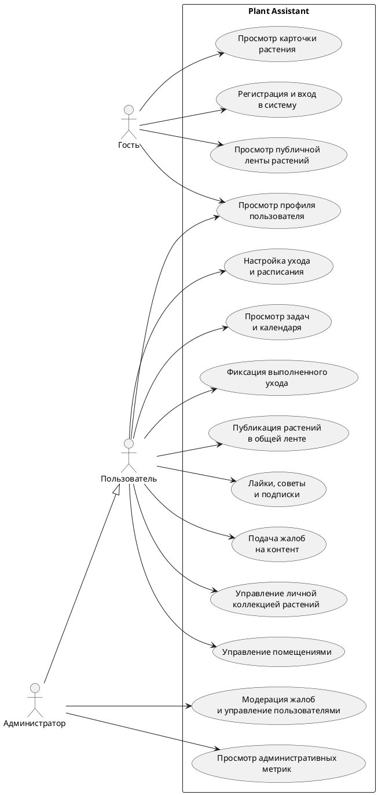

# Глава 1. Анализ предметной области и формулировка требований

## 1.1 Назначение, цель и задачи создания веб-приложения

Plant Assistant представляет собой веб-приложение для учета комнатных растений, планирования регулярного ухода и организации взаимодействия пользователей в рамках единой цифровой среды. Проект ориентирован на пользователей, которые хотят системно вести личную коллекцию растений, фиксировать выполненные процедуры, контролировать предстоящие действия по уходу и при необходимости делиться частью своей коллекции с другими участниками.

Назначение веб-приложения заключается в автоматизации основных процессов, связанных с ведением домашнего или личного каталога растений. Система позволяет хранить сведения о растениях, распределять их по помещениям, задавать правила ухода, формировать список актуальных задач, сохранять историю выполненных действий и использовать социальные функции для публикации растений, получения советов и оценки пользовательской активности.

Целью проекта является разработка веб-приложения, обеспечивающего комплексный подход к учету комнатных растений, организации ухода за ними и поддержке пользовательского взаимодействия на основе современных веб-технологий.

Для достижения поставленной цели в проекте необходимо решить следующие задачи:

- разработать структуру хранения данных о пользователях, помещениях, растениях и действиях по уходу;
- реализовать механизмы регистрации, авторизации и разграничения доступа;
- обеспечить создание, редактирование, просмотр и удаление записей о растениях;
- реализовать настройку периодических процедур ухода и формирование задач на основе этих настроек;
- обеспечить ведение журнала выполненных действий по уходу;
- реализовать публичную ленту растений и механизмы социального взаимодействия пользователей;
- предусмотреть административные функции контроля и модерации пользовательского контента;
- обеспечить удобный интерфейс работы с системой на настольных и мобильных устройствах.

## 1.2 Основные возможности веб-приложения

По текущему состоянию проекта Plant Assistant включает набор функциональных возможностей, охватывающих как персональную работу с данными, так и публичные пользовательские сценарии.

К основным возможностям системы относятся:

- регистрация и авторизация пользователей с доступом к персонализированным данным;
- ведение личного профиля и управление аватаром пользователя;
- создание и ведение каталога комнатных растений;
- группировка растений по помещениям пользователя;
- хранение фотографий растений и их отображение в интерфейсе;
- настройка параметров регулярного ухода с указанием типа процедуры и интервала выполнения;
- автоматическое формирование задач ухода на текущую дату, будущие периоды и просроченные интервалы;
- фиксация факта выполнения процедур и накопление истории ухода;
- просмотр календарного представления задач и общего состояния коллекции;
- публикация растений в общей ленте;
- просмотр публичных профилей пользователей и их растений;
- возможность ставить лайки, оставлять советы и подписываться на других пользователей;
- подача жалоб на пользовательский контент;
- административная обработка жалоб, управление ролями и контроль пользовательской активности.

Функциональные возможности проекта позволяют рассматривать его не только как инструмент личного учета, но и как расширяемую веб-платформу с социальными и административными сценариями.

## 1.3 Категории пользователей и их возможности

В системе можно выделить три основные категории участников взаимодействия: неавторизованный посетитель, зарегистрированный пользователь и администратор.

Неавторизованный посетитель имеет доступ к публичной части веб-приложения. Он может просматривать общую ленту растений, открытые профили пользователей и карточки опубликованных растений. Такой режим работы позволяет познакомиться с возможностями системы без необходимости немедленной регистрации.

Зарегистрированный пользователь получает доступ к персональному функционалу. Для него доступны ведение собственной коллекции растений, работа с помещениями, настройка ухода, отметка выполнения процедур, просмотр календаря задач, редактирование профиля, а также использование социальных функций проекта.

Администратор, помимо пользовательских возможностей, получает доступ к инструментам контроля и модерации. Ему доступны обработка жалоб, изменение ролей, блокировка и разблокировка пользователей, а также просмотр административных показателей, связанных с работой API и пользовательской активностью.

Для наглядного представления основных ролей и вариантов использования может быть применена диаграмма вариантов использования. Ниже приведен код схемы в формате PlantUML.

## 1.4 Анализ предметной области

Предметной областью проекта является организация учета комнатных растений и планирования мероприятий по уходу за ними в условиях персонального использования и сетевого взаимодействия пользователей.

В традиционном подходе пользователи часто ведут сведения о растениях разрозненно: часть информации хранится в заметках, часть запоминается, а часть вовсе не фиксируется. В результате становится сложно отслеживать дату последнего полива, периодичность внесения удобрений, необходимость пересадки или другие регулярные действия. При увеличении количества растений подобная проблема становится особенно заметной, поскольку нагрузка на пользователя возрастает, а вероятность пропуска нужной процедуры увеличивается.

Существующие цифровые решения в данной области нередко концентрируются только на одной стороне задачи: либо на простом списке растений, либо на напоминаниях, либо на справочной информации. Однако для повседневной практики более эффективным является комплексный подход, при котором в одной системе объединяются учет коллекции, управление графиком ухода, история действий, визуальное представление данных и пользовательское взаимодействие.

В рамках рассматриваемой предметной области можно выделить несколько ключевых процессов:

- создание и поддержание актуального перечня растений пользователя;
- распределение растений по помещениям или зонам размещения;
- назначение параметров ухода для каждого растения;
- расчет очередности и сроков выполнения процедур;
- фиксация выполненных действий и накопление истории ухода;
- публикация отдельных растений в открытой ленте;
- обмен советами, оценка публикаций и формирование пользовательских связей;
- контроль корректности контента и административное сопровождение системы.

Основными информационными объектами предметной области являются пользователь, помещение, растение, фотография растения, настройка ухода, запись о выполненном уходе, совет, лайк, подписка, жалоба и действие модератора. Эти объекты формируют логически связанную модель, позволяющую описать как персональные процессы учета растений, так и социальные сценарии взаимодействия.

Таким образом, анализ предметной области показывает, что разрабатываемое веб-приложение должно совмещать функции учетной системы, планировщика регулярных действий и пользовательской платформы с элементами сообщества. Именно такой подход реализован в проекте Plant Assistant.

## 1.5 Формулировка требований к системе

На основе анализа предметной области и фактической реализации проекта можно сформулировать основные требования к системе.

### Функциональные требования

Система должна обеспечивать:

- регистрацию пользователей, вход в систему, выход из системы и получение данных текущего профиля;
- хранение данных о пользователях, их ролях и параметрах доступа;
- создание, просмотр, изменение и удаление помещений пользователя;
- создание, просмотр, изменение и удаление записей о растениях;
- загрузку и отображение изображений растений;
- настройку параметров ухода с указанием типа процедуры и интервала выполнения;
- формирование списка задач ухода по растениям пользователя;
- отображение задач на текущую дату, будущие периоды и просроченные интервалы;
- фиксацию выполненных процедур ухода и ведение истории действий;
- публикацию растений в публичной ленте;
- просмотр профилей пользователей и их публичных растений;
- выполнение социальных действий: лайки, советы, подписки;
- подачу жалоб на пользовательский контент;
- предоставление административного интерфейса для модерации и управления пользователями.

### Нефункциональные требования

Система должна удовлетворять следующим нефункциональным требованиям:

- приложение должно быть доступно через веб-браузер без установки специализированного клиентского программного обеспечения;
- интерфейс должен быть адаптирован как для настольных устройств, так и для мобильного использования;
- структура системы должна обеспечивать разделение клиентской и серверной частей;
- обмен данными между частями системы должен осуществляться через REST API;
- хранение данных должно выполняться в реляционной базе данных PostgreSQL;
- система должна поддерживать расширение функциональности без полной переработки архитектуры;
- пользовательский интерфейс должен обеспечивать понятную навигацию и наглядное представление данных.

### Требования к безопасности и надежности

Важным направлением является обеспечение безопасной и устойчивой работы системы. В связи с этим веб-приложение должно:

- использовать аутентификацию пользователей на основе токенов доступа;
- разграничивать права доступа в зависимости от роли пользователя;
- ограничивать доступ к персональным данным и операциям редактирования;
- выполнять проверку входных данных на стороне сервера;
- обеспечивать защиту от несанкционированного изменения и удаления данных;
- поддерживать механизмы модерации и административного контроля;
- обеспечивать целостность данных при работе со связанными сущностями.

### Требования к качеству сопровождения

Для удобства развития и сопровождения проекта система должна иметь:

- модульную структуру серверной и клиентской частей;
- документированный API-контракт;
- набор автоматизированных тестов для проверки ключевых сценариев;
- единообразную организацию кода и данных.

Сформулированные требования соответствуют реальному назначению проекта Plant Assistant и определяют основу для дальнейшего описания архитектуры, структуры данных, программной реализации и тестирования системы в последующих главах пояснительной записки.
