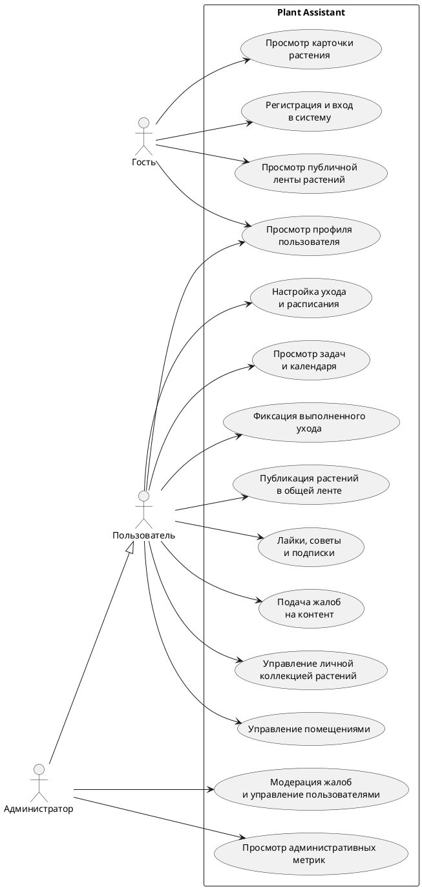

# Глава 1. Анализ предметной области и формулировка требований

## 1.1 Назначение, цель и задачи создания веб-приложения

Plant Assistant - веб-приложение для учета комнатных растений, планирования регулярного ухода и организации взаимодействия пользователей в общей цифровой среде. Проект ориентирован на тех, кому важно системно вести личную коллекцию растений, фиксировать выполненные процедуры, контролировать предстоящие действия по уходу и при необходимости делиться частью своей коллекции с другими участниками.

Назначение веб-приложения связано с автоматизацией основных процессов, сопровождающих ведение домашнего или личного каталога растений. Система позволяет хранить сведения о растениях, распределять их по помещениям, задавать правила ухода, формировать перечень актуальных задач, сохранять историю выполненных действий и использовать социальные функции для публикации растений, получения советов и оценки пользовательской активности.

Цель проекта состоит в разработке веб-приложения, обеспечивающего комплексный подход к учету комнатных растений, организации ухода за ними и поддержке пользовательского взаимодействия на основе современных веб-технологий.

Для достижения поставленной цели в проекте необходимо решить несколько связанных задач: разработать структуру хранения сведений о пользователях, помещениях, растениях и действиях по уходу, реализовать механизмы регистрации, авторизации и разграничения доступа, обеспечить создание, редактирование, просмотр и удаление записей о растениях, реализовать настройку периодических процедур ухода и формирование задач на основе этих настроек, обеспечить ведение журнала выполненных действий по уходу, реализовать публичную ленту растений и механизмы социального взаимодействия пользователей, предусмотреть административные функции контроля и модерации пользовательского контента, обеспечить удобный интерфейс работы с системой на настольных и мобильных устройствах.

## 1.2 Основные возможности веб-приложения

По текущему состоянию проекта Plant Assistant включает набор функциональных возможностей, охватывающих как персональную работу с информацией, так и публичные пользовательские сценарии. Иначе говоря, система не сводится только к каталогу растений или только к социальной ленте: обе линии работы соединены в одном интерфейсе.

К основным возможностям системы относятся регистрация и авторизация пользователей с доступом к персонализированным сведениям, ведение личного профиля и управление аватаром пользователя, создание и ведение каталога комнатных растений, группировка растений по помещениям пользователя, хранение фотографий растений и их отображение в интерфейсе, настройка параметров регулярного ухода с указанием типа процедуры и интервала выполнения, автоматическое формирование задач ухода на текущую дату, будущие периоды и просроченные интервалы, фиксация факта выполнения процедур и накопление истории ухода, просмотр календарного представления задач и общего состояния коллекции, публикация растений в общей ленте, просмотр публичных профилей пользователей и их растений, возможность ставить лайки, оставлять советы и подписываться на других пользователей, подача жалоб на пользовательский контент, административная обработка жалоб, управление ролями и контроль пользовательской активности.

Функциональные возможности проекта позволяют рассматривать его как инструмент личного учета с возможностью дальнейшего расширения до веб-платформы с социальными и административными сценариями. Это заметно уже на уровне состава модулей.

## 1.3 Категории пользователей и их возможности

В системе можно выделить три основные категории участников взаимодействия: неавторизованный посетитель, зарегистрированный пользователь и администратор.

Неавторизованный посетитель получает доступ к публичной части веб-приложения. Ему доступны просмотр общей ленты растений, открытых профилей пользователей и карточек опубликованных растений. Такой режим работы позволяет познакомиться с возможностями системы без немедленной регистрации.

Зарегистрированный пользователь получает доступ к персональному функционалу. Для него предусмотрены ведение собственной коллекции растений, работа с помещениями, настройка ухода, отметка выполнения процедур, просмотр календаря задач, редактирование профиля, использование социальных функций проекта.

Администратор, помимо пользовательских возможностей, получает инструменты контроля и модерации. В его распоряжении находятся обработка жалоб, изменение ролей, блокировка и разблокировка пользователей, а еще просмотр административных показателей, связанных с работой API и пользовательской активностью.

Для наглядного представления основных ролей и вариантов использования может применяться диаграмма вариантов использования. Ниже приведен код схемы в формате PlantUML.

## 1.4 Анализ предметной области

Предметная область проекта связана с организацией учета комнатных растений и планированием мероприятий по уходу за ними при персональном использовании и сетевом взаимодействии пользователей.

В традиционном подходе сведения о растениях часто ведутся разрозненно: часть информации хранится в заметках, часть запоминается, еще часть не фиксируется совсем. Из-за этого становится сложнее отслеживать дату последнего полива, периодичность внесения удобрений, необходимость пересадки и другие регулярные действия. Когда количество растений увеличивается, проблема становится особенно заметной, поскольку возрастает нагрузка на пользователя и выше становится вероятность пропуска нужной процедуры.

Существующие цифровые решения в этой области нередко концентрируются только на одной стороне задачи: либо на простом перечне растений, либо на напоминаниях, либо на справочной информации. Для повседневной практики более продуктивным оказывается комплексный подход, при котором в одной системе объединяются учет коллекции, управление графиком ухода, история действий, визуальное представление информации и пользовательское взаимодействие.

В рассматриваемой предметной области можно выделить несколько ключевых процессов: создание и поддержание актуального перечня растений пользователя, распределение растений по помещениям или зонам размещения, назначение параметров ухода для каждого растения, расчет очередности и сроков выполнения процедур, фиксация выполненных действий и накопление истории ухода, публикация отдельных растений в открытой ленте, обмен советами, оценка публикаций и формирование пользовательских связей, контроль корректности контента и административное сопровождение системы.

К основным информационным объектам предметной области относятся пользователь, помещение, растение, фотография растения, настройка ухода, запись о выполненном уходе, совет, лайк, подписка, жалоба и действие модератора. Эти объекты формируют логически связанную модель, позволяющую описать и персональные процессы учета растений, и социальные сценарии взаимодействия.

Анализ предметной области показывает, что разрабатываемое веб-приложение должно совмещать функции учетной системы, планировщика регулярных действий и пользовательской платформы с элементами сообщества. Собственно, к такому подходу и сводится проект Plant Assistant.

## 1.5 Формулировка требований к системе

На основе анализа предметной области и фактической реализации проекта можно сформулировать основные требования к системе.

### Функциональные требования

Система должна обеспечивать регистрацию пользователей, вход в систему, выход из системы и получение сведений текущего профиля, хранение сведений о пользователях, их ролях и параметрах доступа, создание, просмотр, изменение и удаление помещений пользователя, создание, просмотр, изменение и удаление записей о растениях, загрузку и отображение изображений растений, настройку параметров ухода с указанием типа процедуры и интервала выполнения, формирование списка задач ухода по растениям пользователя, отображение задач на текущую дату, будущие периоды и просроченные интервалы, фиксацию выполненных процедур ухода и ведение истории действий, публикацию растений в публичной ленте, просмотр профилей пользователей и их публичных растений, выполнение социальных действий, включая лайки, советы и подписки, подачу жалоб на пользовательский контент, предоставление административного интерфейса для модерации и управления пользователями.

### Нефункциональные требования

Система должна удовлетворять следующим нефункциональным требованиям: приложение должно быть доступно через веб-браузер без установки специализированного клиентского программного обеспечения, интерфейс должен быть адаптирован как для настольных устройств, так и для мобильного использования, структура системы должна обеспечивать разделение клиентской и серверной частей, обмен информацией между частями системы должен выполняться через REST API, хранение информации должно выполняться в реляционной СУБД PostgreSQL, система должна поддерживать расширение функциональности без полной переработки архитектуры, а пользовательский интерфейс должен обеспечивать понятную навигацию и наглядное представление информации.

### Требования к безопасности и надежности

Отдельного внимания требует безопасная и устойчивая работа системы. По этой причине веб-приложение должно использовать аутентификацию пользователей на основе токенов доступа, разграничивать права доступа в зависимости от роли пользователя, ограничивать доступ к персональным сведениям и операциям редактирования, выполнять проверку входной информации на стороне сервера, обеспечивать защиту от несанкционированного изменения и удаления сведений, поддерживать механизмы модерации и административного контроля, обеспечивать целостность сведений при работе со связанными сущностями.

### Требования к качеству сопровождения

Для удобства развития и сопровождения проекта система должна иметь модульную структуру серверной и клиентской частей, документированный API-контракт, набор автоматизированных тестов для проверки ключевых сценариев, единообразную организацию кода и хранимой информации.

Сформулированные требования соответствуют реальному назначению проекта Plant Assistant и задают основу для дальнейшего описания архитектуры, структуры сущностей, программной реализации и тестирования системы в последующих главах пояснительной записки.
