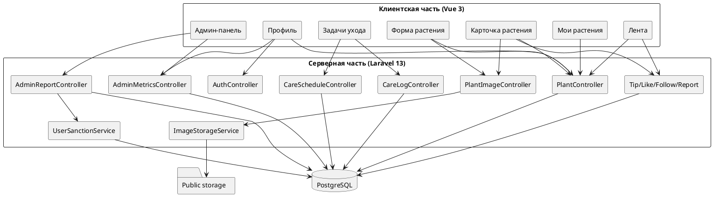
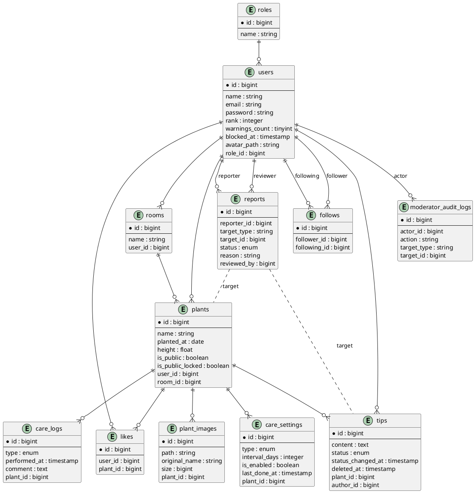
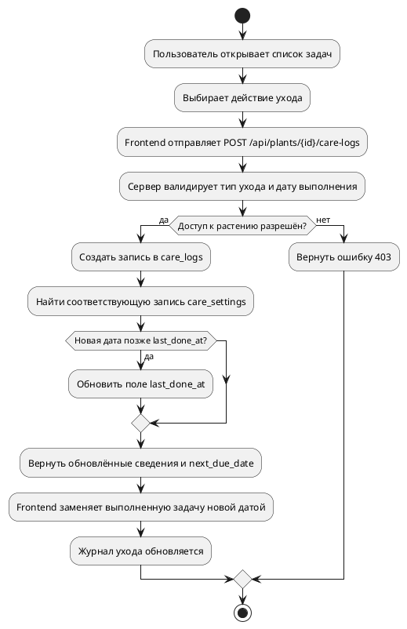

# Глава 3. Проектирование и программирование

## 3.1 Описание и архитектура разрабатываемого продукта

Plant Assistant - клиент-серверное веб-приложение, предназначенное для хранения сведений о комнатных растениях, планирования регулярного ухода, фиксации выполненных процедур и организации взаимодействия пользователей в общей ленте. В отличие от узкоспециализированных трекеров или справочных сервисов, система строится как единая информационная среда, где персональные, социальные и административные функции опираются на общую модель сведений.

Архитектурно приложение разделено на две независимые части. Серверная часть реализована на Laravel 13 и включает REST API, бизнес-логику, авторизацию, работу с базой данных, модерацию и файловое хранилище. Клиентская часть реализована на Vue 3 и отвечает за адаптивный одностраничный интерфейс, маршрутизацию, формы ввода, локальное состояние и визуальное представление информации. Такое разделение упрощает сопровождение проекта, помогает четче разграничить ответственность между уровнями системы и оставляет запас для дальнейшего масштабирования без полной переработки архитектуры.

### 3.1.1 Требования к функционалу и внешнему виду

При проектировании интерфейса учитывались требования первой главы. Приложение должно быть доступно через браузер без установки отдельного клиентского ПО, поддерживать основные сценарии работы, включая просмотр ленты, работу со своей коллекцией, редактирование растения, планирование ухода, просмотр задач, работу с профилем и модерацию, обеспечивать разделение доступа для гостя, пользователя и администратора, а также наглядно показывать состояние коллекции, задач и публикаций. Что немаловажно, интерфейс должен оставаться удобным как на настольных, так и на мобильных устройствах.

Визуальная система приложения реализована на основе светлой темы с естественными растительными акцентами. В файле `tokens.css` заданы основные переменные оформления: фоновый цвет `#eef1ec`, основной цвет поверхности `#ffffff`, цвет текста `#172118`, тематический зеленый акцент `#16843a`, а еще дополнительные цвета для состояний - синий, желтый, красный и оранжевый. Основным шрифтом интерфейса выбрано семейство `Trebuchet MS` с резервным вариантом `Segoe UI`. Такой выбор связан с хорошей читаемостью, мягким визуальным характером и достаточной универсальностью для настольной и мобильной версии. В качестве базовых элементов оформления используются карточки, панели, строка фильтрации, модальные окна, адаптивные формы и навигационные оболочки.

В настольной версии применяется боковая навигация, а в мобильной - нижняя панель перехода между разделами. На первый взгляд решение довольно стандартное, однако в этой системе оно действительно уменьшает количество лишних действий и сохраняет понятную логику работы на разных устройствах.

[Рисунок 3.1 - Макет главной страницы приложения: навигация, лента растений, фильтры и карточки публикаций]

[Рисунок 3.2 - Макет страницы "Мои растения": список коллекции, фильтрация и календарь ухода]

[Рисунок 3.3 - Макет карточки растения: фотографии, параметры, календарь задач, советы и действия пользователя]

[Рисунок 3.4 - Макет административной панели: жалобы, пользователи, метрики и аудит действий]

### 3.1.2 Основные характеристики программного продукта

К числу основных характеристик Plant Assistant относятся одностраничный адаптивный интерфейс пользователя, REST API с JSON-ответами, ролевая модель доступа `user` и `admin`, авторизация на основе токенов Laravel Sanctum, хранение прикладной информации в PostgreSQL, работа с изображениями растений и аватаров через выделенное файловое хранилище, поддержка социальной активности в виде лайков, советов и подписок, а еще поддержка жалоб, модерации, аудита административных действий, OpenAPI-описания API и набора автоматизированных тестов.

Маршрутизация клиентской части охватывает ключевые страницы приложения. Маршрут `/feed` отвечает за публичную и персонализированную ленту, `/my-plants` - за личную коллекцию растений, `/plants/:id` - за карточку растения, а пути `/add-plant`, `/plants/:id/edit`, `/plants/:id/care` и `/plants/:id/photos` используются для создания и редактирования растения. Маршрут `/tasks` открывает список задач ухода, `/profile` объединяет регистрацию, вход, профиль и личную аналитику, `/users/:id` показывает публичный профиль пользователя, а `/admin` ведет в административную панель.

### 3.1.3 Входная и выходная информация

Входная информация системы формируется пользователем через формы интерфейса и через API-запросы. Основные типы входных сведений приведены в таблице 3.1.

| Вид сведений | Источник ввода | Примеры полей |
| --- | --- | --- |
| Сведения учетной записи | формы регистрации и входа | `name`, `email`, `password`, `password_confirmation` |
| Сведения профиля | форма редактирования профиля | имя, email, новый пароль, аватар |
| Сведения растения | форма добавления и редактирования растения | `name`, `room`, `height`, `plantedAt`, `isPublic` |
| Настройки ухода | секция графика ухода | включение типа ухода, интервал в днях |
| Медиафайлы | формы загрузки изображений | аватар, фотографии растений |
| Социальные сведения | модальные формы и кнопки действий | текст совета, лайк, подписка |
| Жалобы и модерация | формы отправки и обработки жалоб | причина, подробности, комментарий модератора, тип санкции |

Выходная информация формируется серверной частью и отображается на страницах приложения. Ее основные виды приведены в таблице 3.2.

| Вид сведений | Форма представления |
| --- | --- |
| Карточки растений | списки и плитки в ленте и в личной коллекции |
| График ухода | календарные элементы и список задач |
| История действий | журнал выполненного ухода |
| Фотографии | галерея растения и аватар пользователя |
| Социальные сведения | лайки, советы, подписки, публичные профили |
| Административные сведения | жалобы, действия модератора, показатели трафика |
| Сообщения системы | уведомления об успехе, ошибках и ограничениях доступа |

### 3.1.4 Функциональная структура приложения

Функциональная структура приложения представлена на рисунке 3.5.



[Рисунок 3.5 - Функциональная структура Plant Assistant]

Из диаграммы видно, что клиентская часть разделена на набор специализированных экранов, каждый из которых обращается к API соответствующего серверного модуля. Логика хранения файлов и применения санкций вынесена в отдельные сервисы, поэтому связность контроллеров снижается, а сопровождение кода становится проще.

### 3.1.5 Концептуальная и логическая модель данных

К основным объектам предметной области относятся пользователь, роль, комната, растение, настройка ухода, запись об уходе, фотография растения, совет, лайк, подписка, жалоба и административное действие. Между этими объектами формируются связи, определяющие принадлежность растения пользователю, связь задач с растением и привязку социальной активности к конкретным объектам.

Логическая модель данных представлена на рисунке 3.6.



[Рисунок 3.6 - Логическая модель базы данных]

### 3.1.6 Описание таблиц базы данных

Во всех прикладных таблицах, кроме `sessions`, используются служебные поля `created_at` и `updated_at` типа `timestamp`. В качестве первичных ключей применяются поля `id` типа `bigint`. Для сохранения целостности сведений используются внешние ключи, ограничения уникальности и индексы.

#### Таблицы ролей, пользователей и структуры коллекции

Таблица `roles` описывает набор ролей пользователей.

| Поле | Тип | Ограничения | Назначение |
| --- | --- | --- | --- |
| `name` | `string` | `unique`, `not null` | Символьное имя роли (`user`, `admin`) |

Таблица `users` хранит учетные записи пользователей.

| Поле | Тип | Ограничения | Назначение |
| --- | --- | --- | --- |
| `name` | `string` | `not null` | Отображаемое имя пользователя |
| `email` | `string` | `unique`, `not null` | Логин и адрес электронной почты |
| `password` | `string` | `not null`, хранится в виде хеша | Пароль пользователя |
| `role_id` | `foreignId` | `FK -> roles.id`, `cascadeOnDelete` | Ссылка на роль |
| `rank` | `integer` | `default 0` | Рейтинг пользователя по принятым советам |
| `warnings_count` | `unsignedTinyInteger` | `default 0` | Количество предупреждений |
| `blocked_at` | `timestamp` | `nullable` | Дата и время блокировки |
| `block_reason` | `text` | `nullable` | Причина блокировки |
| `avatar_path` | `string` | `nullable` | Путь к файлу аватара |

Таблица `rooms` используется для логической группировки растений по помещениям.

| Поле | Тип | Ограничения | Назначение |
| --- | --- | --- | --- |
| `name` | `string` | `not null` | Название комнаты |
| `user_id` | `foreignId` | `FK -> users.id`, `cascadeOnDelete` | Владелец комнаты |

Таблица `plants` хранит основные сведения о растении.

| Поле | Тип | Ограничения | Назначение |
| --- | --- | --- | --- |
| `name` | `string` | `not null` | Название растения |
| `planted_at` | `date` | `nullable` на уровне БД | Дата посадки или появления растения |
| `height` | `float` | `nullable` | Высота растения |
| `is_public` | `boolean` | `default false` | Признак публикации в ленте |
| `public_hidden_at` | `timestamp` | `nullable` | Время скрытия модератором |
| `public_hidden_by` | `foreignId` | `nullable`, `FK -> users.id`, `nullOnDelete` | Модератор, скрывший публикацию |
| `public_hidden_reason` | `text` | `nullable` | Причина скрытия |
| `is_public_locked` | `boolean` | `default false` | Запрет повторной публикации |
| `hidden_due_to_block` | `boolean` | `default false` | Скрытие из-за блокировки владельца |
| `was_public_before_block` | `boolean` | `default false` | Признак того, что растение было публичным до блокировки |
| `user_id` | `foreignId` | `FK -> users.id`, `cascadeOnDelete` | Владелец растения |
| `room_id` | `foreignId` | `nullable`, `FK -> rooms.id`, `nullOnDelete` | Комната размещения |

#### Таблицы планирования и истории ухода

Таблица `care_settings` хранит правила регулярного ухода.

| Поле | Тип | Ограничения | Назначение |
| --- | --- | --- | --- |
| `plant_id` | `foreignId` | `FK -> plants.id`, `cascadeOnDelete` | Растение, к которому относится настройка |
| `type` | `enum` | `watering`, `fertilizing`, `pruning`, `rotation` | Тип процедуры ухода |
| `interval_days` | `integer` | `nullable` | Интервал повторения в днях |
| `is_enabled` | `boolean` | `default true` | Признак активности правила |
| `last_done_at` | `timestamp` | `nullable` | Последняя дата фактического выполнения |

Таблица `care_logs` хранит историю выполненных действий.

| Поле | Тип | Ограничения | Назначение |
| --- | --- | --- | --- |
| `plant_id` | `foreignId` | `FK -> plants.id`, `cascadeOnDelete` | Растение, для которого выполнено действие |
| `type` | `enum` | `watering`, `fertilizing`, `pruning`, `rotation` | Тип выполненной процедуры |
| `performed_at` | `timestamp` | `not null` | Время выполнения ухода |
| `comment` | `text` | `nullable` | Комментарий пользователя |

#### Таблицы изображений и социальной активности

Таблица `plant_images` хранит фотографии растений.

| Поле | Тип | Ограничения | Назначение |
| --- | --- | --- | --- |
| `plant_id` | `foreignId` | `FK -> plants.id`, `cascadeOnDelete` | Растение, к которому относится изображение |
| `path` | `string` | `not null` | Путь к файлу в хранилище |
| `original_name` | `string` | `nullable` | Исходное имя файла |
| `size` | `unsignedBigInteger` | `default 0` | Размер файла в байтах |

Таблица `tips` хранит советы пользователей.

| Поле | Тип | Ограничения | Назначение |
| --- | --- | --- | --- |
| `plant_id` | `foreignId` | `FK -> plants.id`, `cascadeOnDelete` | Растение, к которому относится совет |
| `author_id` | `foreignId` | `FK -> users.id`, `cascadeOnDelete` | Автор совета |
| `content` | `text` | `not null` | Текст совета |
| `status` | `enum` | `pending`, `accepted`, `rejected`, `default pending` | Статус рассмотрения владельцем |
| `status_changed_at` | `timestamp` | `nullable` | Время смены статуса |
| `deleted_at` | `timestamp` | `nullable`, soft delete | Служебное удаление совета |

Таблица `likes` хранит отметки одобрения для публичных растений.

| Поле | Тип | Ограничения | Назначение |
| --- | --- | --- | --- |
| `user_id` | `foreignId` | `FK -> users.id`, `cascadeOnDelete` | Пользователь, поставивший лайк |
| `plant_id` | `foreignId` | `FK -> plants.id`, `cascadeOnDelete` | Растение, получившее лайк |
| — | — | `unique(user_id, plant_id)` | Исключение повторных лайков |

Таблица `follows` хранит связи подписки между пользователями.

| Поле | Тип | Ограничения | Назначение |
| --- | --- | --- | --- |
| `follower_id` | `foreignId` | `FK -> users.id`, `cascadeOnDelete` | Пользователь, который подписывается |
| `following_id` | `foreignId` | `FK -> users.id`, `cascadeOnDelete` | Пользователь, на которого подписываются |
| — | — | `unique(follower_id, following_id)` | Исключение повторных подписок |

#### Таблицы модерации и инфраструктуры

Таблица `reports` хранит жалобы на растения и советы.

| Поле | Тип | Ограничения | Назначение |
| --- | --- | --- | --- |
| `reporter_id` | `foreignId` | `FK -> users.id`, `cascadeOnDelete` | Пользователь, отправивший жалобу |
| `target_type` | `string` | `not null` | Тип объекта жалобы (`plant` или `tip`) |
| `target_id` | `unsignedBigInteger` | `not null` | Идентификатор объекта жалобы |
| `status` | `enum` | `pending`, `accepted`, `rejected`, `default pending` | Статус рассмотрения |
| `reason` | `string` | `not null` | Краткая причина жалобы |
| `details` | `text` | `nullable` | Подробное описание |
| `admin_comment` | `text` | `nullable` | Комментарий администратора |
| `resolution_action` | `string` | `nullable` | Выбранная санкция |
| `resolution_summary` | `text` | `nullable` | Результат применения санкции |
| `reviewed_by` | `foreignId` | `nullable`, `FK -> users.id`, `nullOnDelete` | Администратор, обработавший жалобу |
| `reviewed_at` | `timestamp` | `nullable` | Время обработки |
| — | — | `unique(reporter_id, target_type, target_id)` | Защита от повторной жалобы на тот же объект |

Таблица `moderator_audit_logs` фиксирует действия модератора.

| Поле | Тип | Ограничения | Назначение |
| --- | --- | --- | --- |
| `actor_id` | `foreignId` | `FK -> users.id`, `cascadeOnDelete` | Администратор, выполнивший действие |
| `action` | `string(120)` | `not null` | Код операции |
| `target_type` | `string(120)` | `nullable` | Тип затронутого объекта |
| `target_id` | `unsignedBigInteger` | `nullable` | Идентификатор объекта |
| `payload` | `json` | `nullable` | Дополнительные сведения о действии |
| `ip` | `string(64)` | `nullable` | IP-адрес источника |
| `user_agent` | `text` | `nullable` | Идентификатор пользовательского агента |

Таблица `sessions` используется при работе с серверными сессиями.

| Поле | Тип | Ограничения | Назначение |
| --- | --- | --- | --- |
| `id` | `string` | `primary` | Идентификатор сессии |
| `user_id` | `foreignId` | `nullable`, `index` | Пользователь сессии |
| `ip_address` | `string(45)` | `nullable` | IP-адрес |
| `user_agent` | `text` | `nullable` | Пользовательский агент |
| `payload` | `longText` | `not null` | Сведения сессии |
| `last_activity` | `integer` | `index` | Время последней активности |

#### Индексы и ограничения производительности

Для ускорения работы приложения и типовых выборок в проекте добавлены дополнительные индексы: `plants_user_created_idx`, `plants_public_created_idx`, `plants_room_name_idx`, `care_settings_plant_type_idx`, `care_settings_enabled_last_done_idx`, `care_logs_plant_performed_idx`, `tips_plant_status_created_idx`, `tips_author_created_idx`, `likes_plant_created_idx`, `follows_following_created_idx`, `follows_follower_created_idx`, `reports_status_created_idx`, `reports_target_status_idx`, `plant_images_plant_created_idx`, а также индексы аудита `mod_audit_actor_created_idx` и `mod_audit_action_created_idx`. Их использование уменьшает стоимость поиска публичных растений, ближайших задач ухода, жалоб по статусу, изображений по растению и административных действий по времени.

## 3.2 Разработка внутренней структуры и программирование

### 3.2.1 Физическая структура проекта

Физическая структура проекта отражает разделение на серверную часть Laravel и отдельный каталог клиентской части.

```text
plantAssistant/
|-- app/
|   |-- DTO/
|   |-- Http/
|   |   |-- Controllers/Api/
|   |   |-- Middleware/
|   |   |-- Requests/Api/
|   |   `-- Resources/
|   |-- Models/
|   |-- Policies/
|   `-- Services/
|-- database/
|   |-- factories/
|   |-- migrations/
|   `-- seeders/
|-- routes/
|   |-- api.php
|   `-- web.php
|-- public/
|-- storage/
|-- tests/
|   |-- Feature/
|   `-- Unit/
|-- frontend/
|   |-- src/
|   |   |-- app/
|   |   |-- entities/
|   |   |-- features/
|   |   |-- pages/
|   |   |-- shared/
|   |   `-- widgets/
|   `-- package.json
|-- composer.json
`-- README.md
```

В корне репозитория присутствуют и стандартные служебные файлы Laravel-сборки, однако фактический пользовательский SPA-интерфейс реализован именно в каталоге `frontend`. По этой причине при описании клиентской части основное внимание уделяется структуре `frontend/src`.

Назначение ключевых каталогов распределено достаточно прозрачно. Папка `app/Http/Controllers/Api` содержит контроллеры REST API, `app/Http/Requests/Api` - правила валидации входной информации, `app/Http/Resources` - преобразование моделей в JSON-структуры ответа, `app/Models` - модели предметной области и связи между ними, `app/Policies` - правила разграничения доступа, а `app/Services` - вспомогательную прикладную логику, вынесенную из контроллеров. Каталог `database/migrations` хранит описание структуры базы данных, `tests/Feature` - интеграционные и контрактные тесты, `frontend/src/pages` - страницы приложения, `frontend/src/entities` - бизнес-сущности клиентской части, `frontend/src/features` - прикладные пользовательские функции, `frontend/src/widgets` - крупные составные блоки интерфейса, а `frontend/src/shared` - общие утилиты, API-клиент, валидацию и UI-компоненты.

### 3.2.2 Применяемые средства программирования

Для реализации проекта используются `PHP 8.3` как язык серверной части, `Laravel 13` как фреймворк разработки API, `Laravel Sanctum` для токенной аутентификации, `PostgreSQL` как реляционная СУБД, `Vue 3` для построения клиентского интерфейса, `Vue Router` для маршрутизации, `Pinia` для управления состоянием, `vee-validate` и `zod` для валидации форм на клиенте, `Vite` для сборки фронтенда, `lucide-vue-next` для набора иконок, `Chart.js` и `vue-chartjs` для пользовательской аналитики, `PHPUnit` для автоматизированного тестирования. Такой технологический набор соответствует задаче разработки современного веб-приложения со сложной структурой сведений, ролями доступа и интерактивным интерфейсом.

### 3.2.3 Алгоритм обработки данных в приложении

Одним из ключевых сценариев работы системы является отметка выполненного ухода. Этот сценарий важен, поскольку он связывает пользовательский интерфейс, таблицу истории действий и пересчет следующей даты выполнения процедуры.

Алгоритм процесса представлен на рисунке 3.7.



[Рисунок 3.7 - Алгоритм отметки выполненного ухода]

На клиентской стороне за эту операцию отвечает store задач. Он отправляет запрос к API, временно помечает задачу как выполняемую, а после успешного ответа сервера подменяет текущую дату следующей процедуры новой.

### 3.2.4 Ключевые механизмы программной реализации

Одним из базовых элементов клиентской части является единый API-клиент. Он формирует HTTP-запросы, автоматически подставляет токен доступа и преобразует сообщения об ошибках в удобный для пользователя вид.

```javascript
async request(path, options = {}) {
    const isFormData = options.body instanceof FormData;

    const response = await fetch(`${API_BASE_URL}${path}`, {
        ...options,
        headers: {
            Accept: "application/json",
            ...(options.body && !isFormData
                ? { "Content-Type": "application/json" }
                : {}),
            ...(this.token ? { Authorization: `Bearer ${this.token}` } : {}),
            ...options.headers,
        },
        body: isFormData
            ? options.body
            : options.body
              ? JSON.stringify(options.body)
              : undefined,
    });

    const payload = response.status === 204
        ? null
        : await response.json().catch(() => null);

    if (!response.ok) {
        const message = payload?.message || `API request failed: ${response.status}`;
        throw new Error(toReadableErrorMessage(message));
    }

    return payload;
}
```

Достоинство такого решения состоит в том, что работа с токеном, JSON и типовыми ошибками сосредоточена в одном месте. Это уменьшает дублирование кода и упрощает развитие интерфейса.

Вторым важным механизмом является добавление растения с автоматическим созданием комнаты при необходимости. На уровне store этот сценарий объединяет несколько последовательных операций: поиск комнаты, создание растения, формирование правил ухода и, при наличии файла, загрузку изображения.

```javascript
async addPlant(values, imageFile = null) {
    const roomId = await findOrCreateRoomId(formStringValue(values.room));

    const plantPayload = await apiClient.post(
        "/plants",
        mapPlantFormToApi(values, roomId),
    );

    const plant = plantPayload.data || plantPayload;
    const careSettings = mapCareSettingsFromForm(values);

    await Promise.all(
        careSettings.map((setting) =>
            apiClient.post(`/plants/${plant.id}/care-settings`, setting),
        ),
    );

    if (imageFile) {
        const formData = new FormData();
        formData.append("image", imageFile);
        await apiClient.postForm(`/plants/${plant.id}/images`, formData);
    }

    await this.loadPlants();
    return plant;
}
```

В этом фрагменте видно, что форма растения не ограничивается одной сущностью `plants`. После создания записи автоматически добавляются связанные правила ухода, а затем, при необходимости, загружается изображение. Один пользовательский сценарий приводит к согласованному формированию нескольких связанных объектов - и в этом как раз его практическая ценность.

На стороне сервера ключевой точкой является транзакционная запись факта ухода и обновление связанной настройки.

```php
public function store(Request $request, $plantId)
{
    $validated = $request->validate([
        'type' => ['required', Rule::in(['watering', 'fertilizing', 'pruning', 'rotation'])],
        'performed_at' => 'nullable|date',
        'comment' => 'nullable|string|max:1000',
    ]);

    $performedAt = isset($validated['performed_at'])
        ? Carbon::parse($validated['performed_at'])
        : now();

    [$log, $setting] = DB::transaction(function () use ($plantId, $validated, $performedAt) {
        $log = CareLog::create([
            'plant_id' => $plantId,
            'type' => $validated['type'],
            'performed_at' => $performedAt,
            'comment' => $validated['comment'] ?? null,
        ]);

        $setting = CareSetting::where('plant_id', $plantId)
            ->where('type', $validated['type'])
            ->first();

        if ($setting && (! $setting->last_done_at || $performedAt->greaterThan($setting->last_done_at))) {
            $setting->update(['last_done_at' => $performedAt]);
        }

        return [$log, $setting?->fresh('plant')];
    });
}
```

Использование транзакции гарантирует согласованное обновление истории ухода и сведений о последнем выполнении правила. Это особенно важно для последующего расчета задач на ближайшие даты.

### 3.2.5 Подробное описание формы редактирования растения

Одной из центральных форм приложения является `PlantEditPage.vue`. Эта страница используется в нескольких режимах: при создании нового растения, при редактировании общих параметров, при изменении графика ухода и при управлении фотографиями растения.

Форма содержит несколько групп полей. Первая группа относится к самому растению и включает название, комнату, высоту, дату посадки и признак публикации. Вторая описывает параметры ухода, то есть включение или отключение типа процедуры и интервал повторения. Третья группа связана с фотографиями и включает выбор файла, загрузку и удаление изображений.

Структурно форма строится вокруг единого обработчика сохранения. Он определяет текущий режим страницы и выбирает соответствующую операцию.

```javascript
const onSubmit = handleSubmit(async (values) => {
    try {
        if (isEditMode.value && editingPlant.value) {
            if (!editingPlant.value.canManage) {
                toast.error("Нет доступа к редактированию этого растения.");
                router.replace(`/plants/${editingPlant.value.id}`);
                return;
            }

            if (pageMode.value === "care") {
                await plantStore.updatePlantCare(editingPlant.value, values);
                toast.success("Настройки ухода сохранены");
            } else {
                await plantStore.updatePlantDetails(editingPlant.value, values);
                toast.success("Настройки растения сохранены");
            }
        } else {
            await plantStore.addPlant(values);
            toast.success("Растение добавлено");
        }

        taskStore.syncFromPlants(plantStore.all);
        router.push(
            isEditMode.value && editingPlant.value
                ? `/plants/${editingPlant.value.id}`
                : "/feed",
        );
    } catch (error) {
        toast.error(error.message);
    }
});
```

Кнопка сохранения реализует полный CRUD-сценарий формы. В режиме создания формируется новая запись растения, в режиме редактирования обновляются основные параметры, в режиме ухода изменяются связанные настройки `care_settings`, а после успешного завершения операции обновляется локальный список задач и выполняется переход на соответствующую страницу.

Отдельно реализованы действия для блока фотографий. Кнопка загрузки проверяет тип и размер файла, отправляет его на сервер и обновляет список изображений.

```javascript
const uploadPhoto = async () => {
    if (!photoFile.value || !currentPlantId.value) return;

    photoUploading.value = true;
    try {
        await plantStore.addPlantImage(currentPlantId.value, photoFile.value);
        photoFile.value = null;
        await loadImages();
        toast.success("Фото загружено");
    } catch (error) {
        toast.error(error.message);
    } finally {
        photoUploading.value = false;
    }
};
```

Кнопка удаления выполняет обратную операцию и после подтверждения пользователя удаляет файл через API.

```javascript
const deletePhoto = async (image) => {
    if (!window.confirm("Удалить это фото?")) return;

    try {
        await plantStore.deletePlantImage(image.id, currentPlantId.value);
        await loadImages();
        toast.success("Фото удалено");
    } catch (error) {
        toast.error(error.message);
    }
};
```

Форма `PlantEditPage` хорошо показывает, как в одном интерфейсном узле объединяются операции создания, изменения и удаления сведений, валидация, условное поведение интерфейса, работа с файлами и обновление связанного состояния приложения.

## 3.3 Обеспечение безопасности информации

### 3.3.1 Основные угрозы

Для рассматриваемого приложения существенными являются несанкционированный доступ к личным сведениям пользователя и его растениям, попытки редактирования или удаления чужих растений, получение доступа к административным функциям обычным пользователем, загрузка недопустимых файлов, нарушение целостности сведений при повторных лайках, подписках или жалобах, злоупотребление публичными функциями и публикация некорректного контента, а также сохранение активных токенов и сессий после блокировки пользователя.

### 3.3.2 Средства защиты, реализованные в проекте

Защита информации обеспечивается сочетанием нескольких механизмов.

#### Аутентификация и авторизация

Для доступа к защищенным операциям используется Laravel Sanctum. После успешной регистрации или входа пользователь получает токен доступа, который клиентская часть передает в заголовке `Authorization: Bearer ...`. На стороне клиента токен централизованно используется через единый API-клиент.

На сервере защищенные маршруты помещены в группу middleware, где `auth:sanctum` проверяет наличие и корректность токена, `not_blocked` запрещает действия для заблокированного пользователя, а `admin` допускает только администратора. На клиентской стороне дополнительно применяются route guards маршрутизатора. Для разделов `/my-plants`, `/tasks`, `/add-plant` и других личных страниц требуется авторизация, а для `/admin` одновременно проверяются и авторизация, и административная роль.

#### Разграничение прав на уровне предметных объектов

Для проверки доступа к отдельным сущностям используются политики Laravel. Например, `PlantPolicy` разрешает просмотр публичного растения любому авторизованному пользователю, изменение растения его владельцу или администратору, удаление растения только владельцу и создание растения любому авторизованному пользователю. Аналогичным образом построены политики для комнат, логов ухода, настроек ухода, изображений, жалоб и социальных действий. За счет этого исключается ситуация, когда пользователь получает возможность работать с чужими объектами только потому, что знает их идентификатор.

#### Валидация входной информации

На стороне сервера все критические операции сопровождаются валидацией. Регистрация требует корректного `email`, уникальности и подтверждения пароля, форма растения проверяет обязательность имени, корректность даты и числовой диапазон высоты, лог ухода контролирует допустимость типа процедуры, жалоба проверяет причину и структуру дополнительных сведений, а загрузка файлов ограничивает тип содержимого и размер. На стороне клиента дополнительная валидация выполняется через `vee-validate` и `zod`, поэтому ошибка может быть показана пользователю еще до отправки сведений на сервер.

#### Защита медиафайлов

Аватары и фотографии растений обрабатываются выделенным сервисом `ImageStorageService`. Он проверяет допустимое расширение файла, сохраняет файл в публичном хранилище, при наличии расширения `gd` выполняет сжатие изображения и удаляет файл из хранилища при удалении записи. На странице загрузки фото дополнительно контролируются MIME-тип и ограничение размера файла в 5 МБ. Это снижает риск загрузки неподходящего или чрезмерно большого контента.

#### Модерация и санкции

Для публичной части приложения реализованы жалобы на растения и советы. Жалоба может быть принята или отклонена администратором, а при принятии применяются санкции, среди которых скрытие растения из публичной ленты, временное предупреждение владельца, удаление растения, удаление совета, снижение ранга автора совета и блокировка пользователя.

Сервис `UserSanctionService` реализует правило автоматической блокировки после трех предупреждений. При блокировке обнуляется ранг пользователя, скрываются его публичные растения, удаляются активные советы, уничтожаются токены доступа и удаляются серверные сессии. Такая схема защищает систему от повторного использования уже выданного доступа и не дает обойти наложенные санкции.

#### Контроль целостности сведений

Для поддержания корректного состояния базы данных применяются внешние ключи, ограничения уникальности для таблиц `likes`, `follows`, `reports`, каскадное удаление зависимых сущностей, `nullOnDelete` в тех случаях, когда объект может продолжить существование без связанного элемента, а еще транзакции при обновлении взаимосвязанных записей.

#### Аудит и обработка ошибок

Все административные действия фиксируются в таблице `moderator_audit_logs`. Это позволяет восстанавливать историю решений модератора и разбирать спорные случаи, если к ним приходится возвращаться позже.

Для API реализована единая JSON-обработка ошибок. Код `401` означает, что требуется аутентификация, `403` - что доступ запрещен, `404` - что ресурс не найден, `405` - что метод не разрешен, а `422` указывает на ошибку валидации. Такой подход делает поведение системы предсказуемым и упрощает клиентскую обработку исключений.

### 3.3.3 Формы авторизации и их назначение

В системе используются две основные формы: форма регистрации с полями имени, email, пароля и подтверждения пароля, а также форма входа с полями email и пароля. Разделение на две формы объясняется различием сценариев. Регистрация создает новую учетную запись и сразу выдает токен доступа, тогда как форма входа предназначена для повторного получения доступа к уже существующему профилю. Обе формы вынесены на страницу профиля и включены в единый пользовательский сценарий начала работы с системой.

## 3.4 Тестирование и проверка работоспособности

### 3.4.1 Установка и подготовка рабочей среды

Проверка приложения начинается с развертывания серверной и клиентской частей. Для backend используются стандартные команды Laravel и PostgreSQL.

```bash
composer install
php artisan key:generate
php artisan migrate --seed
php artisan storage:link
php artisan serve
```

Пользовательская клиентская часть располагается в отдельном каталоге `frontend` и запускается собственной сборкой.

```bash
cd frontend
npm install
npm run dev
```

Для автоматизированной проверки серверной части и контрактов OpenAPI используется команда:

```bash
composer test
```

Для проверки клиентской части могут использоваться следующие команды:

```bash
cd frontend
npm run build
npm run lint
npm run smoke
```

### 3.4.2 Контрольный пример и тестовые сведения

Для проверки работоспособности приложения достаточно набора тестовых сведений, включающего роль `admin` и роль `user`, не менее двух пользователей, несколько комнат пользователя, например "Кухня" и "Гостиная", два-три растения с разными интервалами ухода, фотографии растений, несколько советов, часть которых принята, а часть ожидает рассмотрения, жалобы на растение и на совет, а также тестовую учетную запись администратора. Такой набор позволяет проверить и обычные пользовательские сценарии, и административные операции.

### 3.4.3 Примеры проверяемых сценариев

Результаты проверки целесообразно фиксировать в виде таблицы. Пример контрольных сценариев приведен в таблице 3.3.

| № | Проверяемый сценарий | Входные сведения | Ожидаемый результат |
| --- | --- | --- | --- |
| 1 | Регистрация пользователя | имя, email, пароль, подтверждение | создается учетная запись и токен доступа |
| 2 | Вход в систему | корректные email и пароль | пользователь авторизуется и получает сведения профиля |
| 3 | Создание растения | название, комната, дата, интервалы ухода | создается растение и связанные настройки `care_settings` |
| 4 | Загрузка фотографии | изображение PNG/JPG/WEBP | файл сохраняется, фото появляется в галерее растения |
| 5 | Отметка ухода выполненным | тип ухода и дата | создается запись `care_logs`, обновляется `last_done_at` |
| 6 | Отправка совета | текст совета | создается запись `tips` со статусом `pending` |
| 7 | Жалоба на растение | причина и комментарий | создается запись `reports` со статусом `pending` |
| 8 | Рассмотрение жалобы администратором | статус, комментарий, санкция | жалоба получает итоговый статус, применяется выбранное действие |
| 9 | Попытка изменить чужое растение | запрос от постороннего пользователя | сервер возвращает `403 Forbidden` |
| 10 | Попытка загрузить недопустимый файл | неверный формат или слишком большой файл | операция отклоняется, пользователь получает сообщение об ошибке |

### 3.4.4 Автоматизированные тесты

В проекте уже реализован набор feature-тестов, покрывающих наиболее критичные сценарии. Тест `PlantAccessControlTest` проверяет доступ к чужим растениям и сведениям ухода, `ApiMediaAndModerationTest` отвечает за загрузку медиафайлов и административную модерацию, `PublicPlantSocialReadTest` проверяет чтение публичных сведений, `AdminAndCachingInfrastructureTest` затрагивает административную инфраструктуру и сервисные механизмы, а `OpenApiContractTest` контролирует согласованность OpenAPI-описания и фактических маршрутов.

Наличие контрактных тестов для OpenAPI особенно полезно, поскольку приложение использует четко выраженное разделение между клиентской и серверной частями. Такое тестирование помогает обнаружить расхождение между документацией API и реальной реализацией маршрутов.

### 3.4.5 Выводы по тестированию

Проверка работоспособности Plant Assistant должна подтверждать корректное создание и изменение основных сущностей, правильный расчет задач ухода на основе интервалов, невозможность работы с чужими сведениями без соответствующих прав, корректную обработку загрузки медиафайлов, устойчивую работу сценариев жалоб и модерации, а также согласованность маршрутов API и их документированного контракта.

Подводя итог, программная реализация проекта соответствует поставленным требованиям: структура приложения разделена по уровням ответственности, логика предметной области опирается на связанную модель сведений, ключевые сценарии обеспечены валидацией и разграничением доступа, а работоспособность системы может проверяться и вручную, и автоматизированными тестами.
