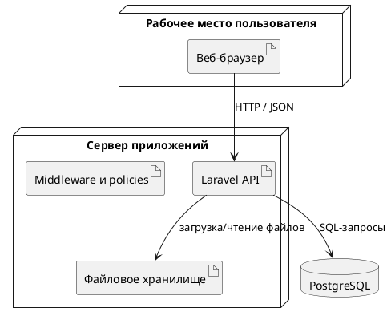

# Глава 4. Тестирование и проверка работоспособности системы

## 4.1 Конфигурация системы

В настоящей главе проверка работоспособности Plant Assistant рассматривается с точки зрения конфигурации среды, состава программных средств, требований к ресурсам и эксплуатационных характеристик. Такой подход соответствует фактической структуре проекта: для оценки готовности системы недостаточно выполнить только отдельные тестовые сценарии, необходимо еще показать, в каких условиях приложение может быть развернуто, насколько оно устойчиво, понятно пользователю и пригодно к дальнейшему сопровождению.

Разработанное приложение Plant Assistant эксплуатируется как веб-система клиент-серверного типа. Пользователь взаимодействует с интерфейсом через браузер, серверная часть обрабатывает запросы и обращается к БД, а изображения растений и аватары сохраняются в файловом хранилище.

Базовая конфигурация системы включает клиентский интерфейс, выполняемый в браузере пользователя, сервер приложений с PHP и Laravel, реляционную СУБД PostgreSQL, публичное файловое хранилище для аватаров и изображений растений, а также сеть передачи сведений между клиентом и сервером по HTTP.

Логическая схема развертывания представлена на рисунке 4.1.

[Рисунок 4.1 - Схема конфигурации Plant Assistant]

На стороне пользователя не требуется установка специализированного программного обеспечения. Это уменьшает порог входа в систему и упрощает дальнейшее сопровождение, поскольку обновления интерфейса выполняются централизованно на сервере приложения.

## 4.2 Обоснование выбора программного обеспечения

Для реализации системы выбраны распространенные и хорошо документированные средства разработки. Это решение важно не только на этапе программирования, но и с точки зрения последующей эксплуатации и поддержки.

Состав основного программного обеспечения приведен в таблице 4.1.

| Компонент | Назначение | Причина выбора |
| --- | --- | --- |
| `PHP 8.3` | Выполнение серверной логики | Современная версия языка с поддержкой актуального стека Laravel |
| `Laravel 13` | Реализация REST API, валидации, middleware, policies | Высокая скорость разработки и встроенные механизмы безопасности |
| `Laravel Sanctum` | Токенная аутентификация | Удобен для SPA-клиента и защищенных API-маршрутов |
| `PostgreSQL` | Хранение прикладных сведений | Надежная реляционная СУБД с поддержкой ограничений и индексов |
| `Vue 3` | Клиентский интерфейс | Подходит для построения адаптивного SPA |
| `Vue Router` | Маршрутизация страниц | Позволяет разграничивать публичные и защищенные разделы |
| `Pinia` | Управление состоянием клиента | Упрощает работу с растениями, задачами, авторизацией и соцфункциями |
| `vee-validate` и `zod` | Клиентская валидация форм | Уменьшают количество ошибочных запросов |
| `Vite` | Сборка фронтенда | Быстрая разработческая сборка и современный pipeline |
| `PHPUnit` | Автоматизированные тесты | Проверка доступа, модерации и OpenAPI-контрактов |

Выбор такого набора средств позволяет обеспечить разделение серверной и клиентской частей, модульную архитектуру, удобную проверку входной информации, централизованную авторизацию и разграничение ролей, а также возможность дальнейшего наращивания функциональности без отказа от уже построенной структуры.

## 4.3 Требования к аппаратным и вычислительным ресурсам

### 4.3.1 Требования к рабочему месту разработчика

Для локальной разработки и проверки приложения требуется среда, в которой одновременно могут быть запущены серверная часть, БД и клиентская сборка. Минимальная конфигурация приведена в таблице 4.2.

| Компонент | Минимальное требование |
| --- | --- |
| Процессор | 4 логических ядра |
| Оперативная память | 8 ГБ |
| Свободное место на диске | 15-20 ГБ |
| Операционная система | Windows 10/11, Linux или macOS |
| Дополнительное ПО | PHP 8.3, Composer, PostgreSQL, Node.js, npm, Git, браузер |

Указанной конфигурации достаточно для одновременного запуска локального сервера Laravel, базы PostgreSQL и клиентской сборки Vue.

### 4.3.2 Требования к серверной эксплуатации

Поскольку приложение в текущей реализации не выполняет ресурсоемких вычислений, его основные нагрузки связаны с обработкой HTTP-запросов, формированием выборок из PostgreSQL, хранением и выдачей изображений, а также выполнением административных и социальных операций.

Для демонстрационной или учебной эксплуатации достаточно конфигурации, приведенной в таблице 4.3.

| Параметр | Минимальное значение | Рекомендуемое значение |
| --- | --- | --- |
| Процессор | 2 vCPU | 4 vCPU |
| Оперативная память | 4 ГБ | 8 ГБ |
| Дисковое пространство | 20 ГБ | 50 ГБ и более |
| БД | PostgreSQL | PostgreSQL на отдельном диске или узле |
| Файловое хранилище | локальный public disk | выделенное хранилище или объектное хранилище |

Для небольшого числа пользователей главным ограничивающим фактором оказывается не вычислительная мощность процессора, а объем дискового пространства под изображения и скорость выдачи медиафайлов. По мере роста проекта наибольшее внимание потребуется уделять хранению файлов, индексации базы и кэшированию публичных выборок.

## 4.4 Надежность и защита информации

Надежность работы системы обеспечивается несколькими решениями на уровне архитектуры и хранения сведений. К их числу относятся обязательная серверная валидация, применение внешних ключей и ограничений уникальности, использование транзакций для операций, изменяющих связанные записи, централизованная обработка ошибок API, аудит действий администратора, а также уничтожение токенов и сессий при блокировке пользователя.

Целостность сведений поддерживается реляционной моделью. Например, растение не может ссылаться на несуществующего пользователя, лайк не может быть продублирован для одной и той же пары пользователь-растение, жалоба не может быть отправлена повторно на тот же объект тем же пользователем, а при удалении растения автоматически удаляются связанные настройки ухода, логи, изображения, советы и лайки.

С точки зрения защиты информации важны токенная авторизация через Sanctum, middleware `auth:sanctum`, `not_blocked`, `admin`, policy-based доступ к сущностям, ограничения по типу и размеру загружаемых файлов и фиксация административных действий в `moderator_audit_logs`.

Надежность хранения медиафайлов повышается за счет того, что приложение хранит в базе не сами файлы, а ссылки на них, а удаление выполняется через выделенный сервис хранения. Это уменьшает риск рассогласования записей базы и файловой системы.

## 4.5 Эффективность и понятность пользователю

Эффективность системы определяется не только скоростью работы сервера, но и удобством доступа к нужным сведениям. В проекте это обеспечивается отдельными индексами для типовых выборок, пагинацией и ограничением `per_page`, разделением публичных и личных запросов, сжатием загружаемых изображений, использованием одностраничного интерфейса без полной перезагрузки страниц и централизованным клиентским состоянием для повторного использования уже загруженной информации.

Понятность интерфейса поддерживается единой навигационной схемой, разделением экранов по пользовательским задачам, карточным представлением растений, цветовыми индикаторами состояний, модальными окнами для потенциально рискованных действий и человекочитаемыми текстами ошибок и уведомлений.

Особенно важно, что пользователь не работает напрямую с абстрактными таблицами или перечнями сущностей. Интерфейс показывает информацию в форме, соответствующей предметной области: "мои растения", "задачи ухода", "советы", "жалобы", "профиль". Это уменьшает когнитивную нагрузку и ускоряет освоение системы.

## 4.6 Модифицируемость, мобильность и масштабируемость

### 4.6.1 Модифицируемость

Структура проекта позволяет развивать систему без полной переработки уже созданной части. Этому способствуют разделение backend и frontend, выделение сервисов `ImageStorageService`, `UserSanctionService`, `FeedQueryService`, использование DTO, request-классов и resource-классов, модульная организация клиентского кода через `entities`, `features`, `widgets`, `pages`, а также миграции БД.

Если потребуется добавить новый тип ухода, расширить административную панель или ввести экспорт отчетов, изменения можно локализовать в конкретных слоях, а не распределять их хаотично по всему проекту.

### 4.6.2 Мобильность

Приложение является веб-ориентированным, поэтому доступ к нему возможен на настольных компьютерах, ноутбуках, планшетах и смартфонах. В интерфейсе предусмотрены два режима оболочки: настольная версия с боковой навигацией и мобильная версия с нижней навигационной панелью.

Адаптивная верстка уменьшает зависимость системы от конкретного устройства пользователя и позволяет работать с приложением без отдельной мобильной установки.

### 4.6.3 Масштабируемость

С точки зрения дальнейшего роста система имеет несколько предпосылок к масштабированию. БД может быть вынесена на отдельный сервер, файловое хранилище может заменяться выделенным внешним хранилищем, публичные запросы могут кэшироваться, очередь задач уже предусмотрена инфраструктурой Laravel, а административная аналитика может расширяться без изменения клиентской архитектуры.

При увеличении числа пользователей наиболее вероятными зонами роста нагрузки становятся публичная лента растений, выдача изображений, административные выборки жалоб и расчеты календарей при большом объеме сведений. Следовательно, развитие проекта должно сопровождаться оптимизацией индексирования, кэширования и хранения медиафайлов.

## 4.7 Минимизация затрат на сопровождение и поддержку

Снижение затрат на сопровождение достигается за счет использования общеизвестного и документированного технологического стека, отсутствия необходимости устанавливать отдельное клиентское приложение пользователям, централизованных обновлений через серверную часть и веб-интерфейс, наличия миграций БД, автоматизированных тестов и OpenAPI-описания, а также модульной структуры кода.

Поддержка веб-приложения в таком формате обходится дешевле, чем сопровождение разных нативных клиентов для нескольких платформ. Внесение изменений в интерфейс или API не требует распространения пакетов на пользовательские устройства: новая версия становится доступной после обновления сервера и клиентской сборки.

Дополнительное преимущество состоит в возможности подключать к сопровождению разработчиков, уже знакомых со стандартным стеком Laravel + Vue, без необходимости изучения редких или узкоспециализированных технологий.

## 4.8 Выводы по главе

В четвертой главе рассмотрена эксплуатационная конфигурация Plant Assistant и выполнена оценка требований к программным и вычислительным ресурсам. Показано, что приложение имеет типичную для современных веб-систем структуру: браузерный клиент, сервер приложений, реляционную СУБД и файловое хранилище.

Выбранные программные средства обоснованы с точки зрения надежности, удобства разработки и дальнейшего сопровождения. Система не требует значительных вычислительных ресурсов для учебной и демонстрационной эксплуатации, а основные требования к инфраструктуре связаны с хранением изображений и ростом объема пользовательских сведений.

Проведенный анализ показал, что приложение обладает достаточными характеристиками надежности, эффективности, понятности пользователю, мобильности, модифицируемости и масштабируемости. Это позволяет рассматривать Plant Assistant как практически пригодную основу для дальнейшего развития прикладной информационной системы в области хранения сведений о комнатных растениях и планирования ухода за ними.
