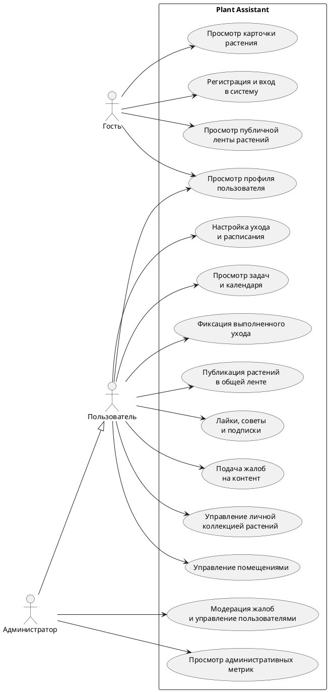
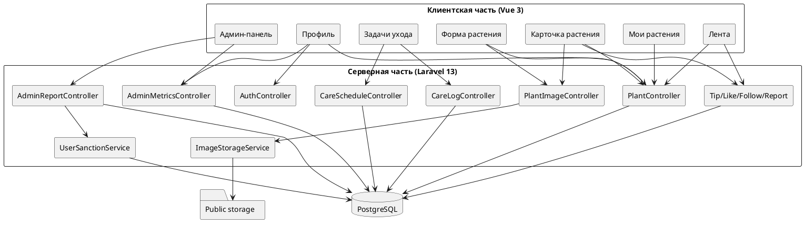
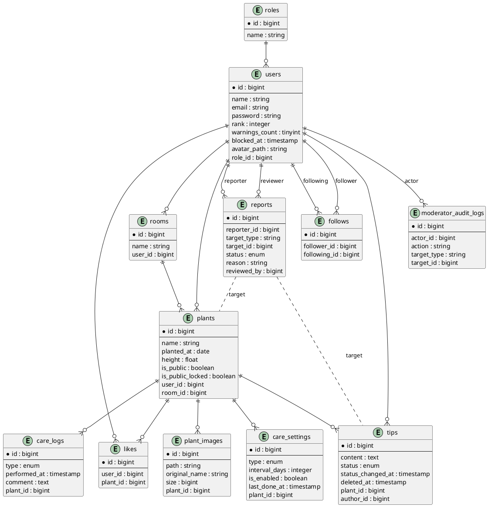
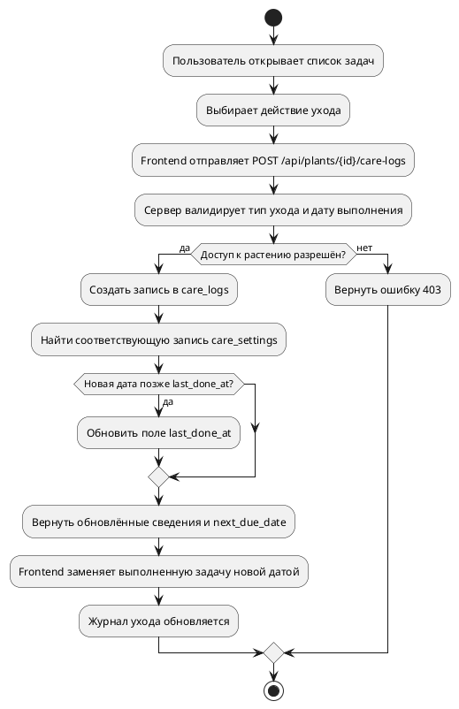
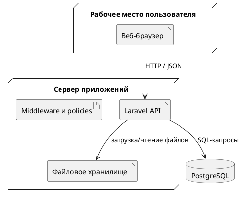

# Введение

В последние годы устойчиво растет интерес к комнатному растениеводству как к доступной и практической форме организации домашнего и рабочего пространства. Комнатные растения выполняют не только декоративную функцию. Они делают среду более комфортной, улучшают визуальное восприятие интерьера и поддерживают повседневную вовлеченность человека в уход за окружающим пространством. При увеличении количества растений заметно возрастает и сложность систематического обслуживания, поскольку для разных видов требуется регулярно выполнять полив, внесение удобрений, пересадку, обрезку, поворот к источнику света и другие мероприятия.

На практике сведения о растениях и выполненных действиях по уходу нередко ведутся разрозненно: в бумажных записях, заметках на мобильных устройствах или вовсе не фиксируются. Из-за этого сложнее контролировать периодичность ухода, анализировать состояние коллекции растений, не пропускать важные процедуры. Примечательно, что дополнительную сложность создает отсутствие единого пространства, где можно было бы не просто хранить сведения о собственных растениях, но и получать обратную связь, обмениваться опытом с другими участниками, отслеживать свою активность в системе.

Актуальность темы связана с необходимостью разработки современной информационной системы, обеспечивающей комплексный подход к учету комнатных растений, планированию мероприятий по уходу и организации пользовательского взаимодействия. Использование веб-приложения в этой области позволяет объединить хранение данных, автоматизацию регулярных операций, визуальное представление результатов и социальные механизмы обмена знаниями в единой цифровой среде.

Plant Assistant - веб-приложение, предназначенное для ведения личной коллекции комнатных растений, настройки расписания ухода, фиксации выполненных процедур, публикации отдельных растений в общей ленте и взаимодействия пользователей друг с другом. Система построена как клиент-серверный проект: серверная часть отвечает за бизнес-логику, хранение и защиту данных, клиентская - за интерактивный пользовательский интерфейс и удобную навигацию по основным сценариям работы.

Цель проекта заключается в разработке веб-приложения для учета комнатных растений и организации ухода за ними, объединяющего персональные инструменты ведения коллекции, механизмы планирования регулярных процедур и социальные функции взаимодействия пользователей.

Для достижения поставленной цели в проекте необходимо решить ряд задач: провести анализ предметной области и существующих подходов к организации учета растений и ухода за ними, определить функциональные и общие требования к разрабатываемой системе, спроектировать архитектуру веб-приложения, структуру его модулей и логическую модель данных, реализовать серверную часть приложения с REST API, механизмами аутентификации, разграничения доступа и обработки пользовательских сведений, реализовать клиентскую часть приложения с удобным интерфейсом для работы с растениями, задачами ухода и публичной лентой, обеспечить поддержку социальных функций, включая публикацию растений, лайки, советы, подписки и модерацию контента, а затем провести тестирование разработанного решения и оценить его работоспособность.

Объектом рассмотрения в проекте является процесс организации учета комнатных растений и планирования мероприятий по уходу за ними в условиях персонального использования и сетевого взаимодействия пользователей.

Предметом рассмотрения являются методы, модели и программные средства разработки веб-приложения для хранения, обработки, представления и анализа данных о комнатных растениях, действиях по уходу и пользовательской активности.

В процессе разработки используются современные средства веб-программирования. Серверная часть приложения реализована с использованием фреймворка Laravel, языка PHP и системы управления базами данных PostgreSQL. Клиентская часть построена на базе Vue 3 с применением маршрутизации, централизованного управления состоянием и модульной организации интерфейса. Обмен данными между частями системы идет по архитектурному стилю REST, что, на первый взгляд, выглядит ожидаемым решением, но здесь это еще и помогает четко разделить ответственность между frontend- и backend-компонентами.

Практическая значимость проекта состоит в создании веб-приложения, которое позволяет систематизировать учет комнатных растений, повысить удобство планирования ухода, обеспечить своевременное выполнение регулярных процедур и предоставить пользователям единое информационное пространство для обмена опытом и взаимодействия. Полученный результат может использоваться для дальнейшего развития прикладной системы в области цифровой поддержки домашнего растениеводства, что немаловажно и с точки зрения расширения пользовательских сценариев.


# Глава 1. Анализ предметной области и формулировка требований

## 1.1 Назначение, цель и задачи создания веб-приложения

Plant Assistant - веб-приложение для учета комнатных растений, планирования регулярного ухода и организации взаимодействия пользователей в общей цифровой среде. Проект ориентирован на тех, кому важно системно вести личную коллекцию растений, фиксировать выполненные процедуры, контролировать предстоящие действия по уходу и при необходимости делиться частью своей коллекции с другими участниками.

Назначение веб-приложения связано с автоматизацией основных процессов, сопровождающих ведение домашнего или личного каталога растений. Система позволяет хранить сведения о растениях, распределять их по помещениям, задавать правила ухода, формировать перечень актуальных задач, сохранять историю выполненных действий и использовать социальные функции для публикации растений, получения советов и оценки пользовательской активности.

Цель проекта состоит в разработке веб-приложения, обеспечивающего комплексный подход к учету комнатных растений, организации ухода за ними и поддержке пользовательского взаимодействия на основе современных веб-технологий.

Для достижения поставленной цели в проекте необходимо решить несколько связанных задач: разработать структуру хранения сведений о пользователях, помещениях, растениях и действиях по уходу, реализовать механизмы регистрации, авторизации и разграничения доступа, обеспечить создание, редактирование, просмотр и удаление записей о растениях, реализовать настройку периодических процедур ухода и формирование задач на основе этих настроек, обеспечить ведение журнала выполненных действий по уходу, реализовать публичную ленту растений и механизмы социального взаимодействия пользователей, предусмотреть административные функции контроля и модерации пользовательского контента, обеспечить удобный интерфейс работы с системой на настольных и мобильных устройствах.

## 1.2 Основные возможности веб-приложения

По текущему состоянию проекта Plant Assistant включает набор функциональных возможностей, охватывающих как персональную работу с информацией, так и публичные пользовательские сценарии. Иначе говоря, система не сводится только к каталогу растений или только к социальной ленте: обе линии работы соединены в одном интерфейсе.

К основным возможностям системы относятся регистрация и авторизация пользователей с доступом к персонализированным сведениям, ведение личного профиля и управление аватаром пользователя, создание и ведение каталога комнатных растений, группировка растений по помещениям пользователя, хранение фотографий растений и их отображение в интерфейсе, настройка параметров регулярного ухода с указанием типа процедуры и интервала выполнения, автоматическое формирование задач ухода на текущую дату, будущие периоды и просроченные интервалы, фиксация факта выполнения процедур и накопление истории ухода, просмотр календарного представления задач и общего состояния коллекции, публикация растений в общей ленте, просмотр публичных профилей пользователей и их растений, возможность ставить лайки, оставлять советы и подписываться на других пользователей, подача жалоб на пользовательский контент, административная обработка жалоб, управление ролями и контроль пользовательской активности.

Функциональные возможности проекта позволяют рассматривать его как инструмент личного учета с возможностью дальнейшего расширения до веб-платформы с социальными и административными сценариями. Это заметно уже на уровне состава модулей.

## 1.3 Категории пользователей и их возможности

В системе можно выделить три основные категории участников взаимодействия: неавторизованный посетитель, зарегистрированный пользователь и администратор.

Неавторизованный посетитель получает доступ к публичной части веб-приложения. Ему доступны просмотр общей ленты растений, открытых профилей пользователей и карточек опубликованных растений. Такой режим работы позволяет познакомиться с возможностями системы без немедленной регистрации.

Зарегистрированный пользователь получает доступ к персональному функционалу. Для него предусмотрены ведение собственной коллекции растений, работа с помещениями, настройка ухода, отметка выполнения процедур, просмотр календаря задач, редактирование профиля, использование социальных функций проекта.

Администратор, помимо пользовательских возможностей, получает инструменты контроля и модерации. В его распоряжении находятся обработка жалоб, изменение ролей, блокировка и разблокировка пользователей, а еще просмотр административных показателей, связанных с работой API и пользовательской активностью.

Для наглядного представления основных ролей и вариантов использования может применяться диаграмма вариантов использования. Ниже приведен код схемы в формате PlantUML.



## 1.4 Анализ предметной области

Предметная область проекта связана с организацией учета комнатных растений и планированием мероприятий по уходу за ними при персональном использовании и сетевом взаимодействии пользователей.

В традиционном подходе сведения о растениях часто ведутся разрозненно: часть информации хранится в заметках, часть запоминается, еще часть не фиксируется совсем. Из-за этого становится сложнее отслеживать дату последнего полива, периодичность внесения удобрений, необходимость пересадки и другие регулярные действия. Когда количество растений увеличивается, проблема становится особенно заметной, поскольку возрастает нагрузка на пользователя и выше становится вероятность пропуска нужной процедуры.

Существующие цифровые решения в этой области нередко концентрируются только на одной стороне задачи: либо на простом перечне растений, либо на напоминаниях, либо на справочной информации. Для повседневной практики более продуктивным оказывается комплексный подход, при котором в одной системе объединяются учет коллекции, управление графиком ухода, история действий, визуальное представление информации и пользовательское взаимодействие.

В рассматриваемой предметной области можно выделить несколько ключевых процессов: создание и поддержание актуального перечня растений пользователя, распределение растений по помещениям или зонам размещения, назначение параметров ухода для каждого растения, расчет очередности и сроков выполнения процедур, фиксация выполненных действий и накопление истории ухода, публикация отдельных растений в открытой ленте, обмен советами, оценка публикаций и формирование пользовательских связей, контроль корректности контента и административное сопровождение системы.

К основным информационным объектам предметной области относятся пользователь, помещение, растение, фотография растения, настройка ухода, запись о выполненном уходе, совет, лайк, подписка, жалоба и действие модератора. Эти объекты формируют логически связанную модель, позволяющую описать и персональные процессы учета растений, и социальные сценарии взаимодействия.

Анализ предметной области показывает, что разрабатываемое веб-приложение должно совмещать функции учетной системы, планировщика регулярных действий и пользовательской платформы с элементами сообщества. Собственно, к такому подходу и сводится проект Plant Assistant.

## 1.5 Формулировка требований к системе

На основе анализа предметной области и фактической реализации проекта можно сформулировать основные требования к системе.

### Функциональные требования

Система должна обеспечивать регистрацию пользователей, вход в систему, выход из системы и получение сведений текущего профиля, хранение сведений о пользователях, их ролях и параметрах доступа, создание, просмотр, изменение и удаление помещений пользователя, создание, просмотр, изменение и удаление записей о растениях, загрузку и отображение изображений растений, настройку параметров ухода с указанием типа процедуры и интервала выполнения, формирование списка задач ухода по растениям пользователя, отображение задач на текущую дату, будущие периоды и просроченные интервалы, фиксацию выполненных процедур ухода и ведение истории действий, публикацию растений в публичной ленте, просмотр профилей пользователей и их публичных растений, выполнение социальных действий, включая лайки, советы и подписки, подачу жалоб на пользовательский контент, предоставление административного интерфейса для модерации и управления пользователями.

### Нефункциональные требования

Система должна удовлетворять следующим нефункциональным требованиям: приложение должно быть доступно через веб-браузер без установки специализированного клиентского программного обеспечения, интерфейс должен быть адаптирован как для настольных устройств, так и для мобильного использования, структура системы должна обеспечивать разделение клиентской и серверной частей, обмен информацией между частями системы должен выполняться через REST API, хранение информации должно выполняться в реляционной СУБД PostgreSQL, система должна поддерживать расширение функциональности без полной переработки архитектуры, а пользовательский интерфейс должен обеспечивать понятную навигацию и наглядное представление информации.

### Требования к безопасности и надежности

Отдельного внимания требует безопасная и устойчивая работа системы. По этой причине веб-приложение должно использовать аутентификацию пользователей на основе токенов доступа, разграничивать права доступа в зависимости от роли пользователя, ограничивать доступ к персональным сведениям и операциям редактирования, выполнять проверку входной информации на стороне сервера, обеспечивать защиту от несанкционированного изменения и удаления сведений, поддерживать механизмы модерации и административного контроля, обеспечивать целостность сведений при работе со связанными сущностями.

### Требования к качеству сопровождения

Для удобства развития и сопровождения проекта система должна иметь модульную структуру серверной и клиентской частей, документированный API-контракт, набор автоматизированных тестов для проверки ключевых сценариев, единообразную организацию кода и хранимой информации.

Сформулированные требования соответствуют реальному назначению проекта Plant Assistant и задают основу для дальнейшего описания архитектуры, структуры сущностей, программной реализации и тестирования системы в последующих главах пояснительной записки.


# Глава 2. Анализ существующих аналогов и прототипов

При разработке Plant Assistant необходимо опираться не только на общие представления о цифровых средствах ухода за растениями, но и на реально существующие программные продукты. По этой причине в настоящей главе выполнен анализ нескольких действующих сервисов, близких по тематике к разрабатываемому веб-приложению.

Чтобы избежать неточностей, связанных с быстрым изменением функциональности коммерческих продуктов, анализ выполнен по открытым сведениям с официальных страниц сервисов по состоянию на 31 мая 2026 года. Для сопоставления выбраны решения, которые особенно часто встречаются в тематике учета растений, рекомендаций по уходу, напоминаний и пользовательского взаимодействия. В число рассматриваемых аналогов включены `PlantIn`, `Planta`, `Gardenize` и `Greg`.

Сравнение строится по нескольким критериям. Учитываются хранение персональных карточек растений, настройка ухода и напоминаний, ведение истории действий, работа с фотографиями, наличие веб-доступа, наличие социальных функций, поддержка средств контроля пользовательского контента и общая применимость для задач, решаемых в Plant Assistant.

## 2.1 Анализ сервиса PlantIn

`PlantIn` - действующий цифровой сервис, ориентированный на идентификацию растений, формирование рекомендаций по уходу и поддержку пользователя при возникновении проблем с растением. По открытым сведениям сервиса пользователь может сфотографировать растение, добавить его в личный список и получать рекомендации по дальнейшему уходу.

Функционально `PlantIn` сочетает определение растения по фотографии, ведение пользовательского перечня растений, рекомендации по поливу и настройке ухода, диагностику болезней растения, консультации с ботаниками, публикации и элементы сообщества, а также синхронизацию веб- и мобильной версии. Примечательно, что сервис соединяет несколько востребованных сценариев сразу: распознавание, советы по уходу и пользовательский контент.

Сильные стороны `PlantIn` связаны прежде всего с развитой справочно-рекомендательной составляющей, сочетанием идентификации, ухода и пользовательского взаимодействия, наличием синхронизации между мобильным и веб-форматом, а еще с ориентацией на массового пользователя и понятный сценарий начала работы. В то же время у сервиса есть ограничения с точки зрения задач текущего проекта. Основной акцент в `PlantIn` делается на идентификацию, консультации и справочную помощь, тогда как функции формализованного учета собственной коллекции, детальной истории регулярного ухода и административной модерации публичного контента в открытом описании сервиса не относятся к числу центральных. Дополнительно часть возможностей продвигается через подписочную модель, что уменьшает доступность полного функционала.

Следовательно, `PlantIn` можно рассматривать как сильный аналог по части идентификации и рекомендаций, однако в роли полного прототипа системы, объединяющей личный учет растений, задачи ухода, журнал действий, жалобы и административное сопровождение, он подходит лишь частично.

## 2.2 Анализ сервиса Planta

`Planta` относится к числу популярных сервисов, ориентированных прежде всего на персонализированный уход за растениями. На официальном сайте подчеркиваются интеллектуальные напоминания о поливе, дополнительные напоминания по другим действиям ухода, идентификация растений, диагностика проблем, журнал и элементы сообщества.

По открытым сведениям `Planta` включает интеллектуальные напоминания о поливе, уведомления о подкормке, опрыскивании, пересадке и очистке, определение растения по фотографии, диагностику проблем растения, измерение освещенности, организацию растений и журнал, обмен графиком ухода и участие в сообществе пользователей. Все это делает сервис заметным ориентиром именно в части автоматизации повседневного ухода.

К преимуществам `Planta` относятся развитая логика напоминаний по нескольким типам процедур, сильная сторона в автоматизации ухода, сочетание трекера ухода, диагностики и фотораспознавания, а также удобная ориентация на ежедневную работу с домашними растениями. Ограничения относительно задач Plant Assistant состоят в том, что в открытом позиционировании `Planta` основное внимание уделяется индивидуальному уходу и пользовательским подсказкам, тогда как полноформатная публичная лента растений с жалобами, ролями, административной обработкой обращений и аудитом действий не выдвигается как самостоятельный ключевой блок. Кроме того, сервис в первую очередь продвигается как мобильное приложение, а для разрабатываемой системы принципиально важен полноценный браузерный формат работы.

`Planta` можно считать сильным аналогом в части персонального ухода и напоминаний, но для задач веб-ориентированного сообщества с разграничением ролей и модерацией его возможностей недостаточно.

## 2.3 Анализ сервиса Gardenize

`Gardenize` позиционируется как цифровой журнал и планировщик сада, доступный на настольных и мобильных устройствах. Сервис позволяет вести базу растений, создавать зоны или участки размещения, записывать события, хранить фотографии, формировать напоминания и экспортировать сведения.

По составу возможностей `Gardenize` включает ведение собственной базы растений, группировку по зонам, участкам и местам размещения, журнал событий и действий, хранение фотографий, веб-версию для работы с настольного устройства, мобильную версию, экспорт сведений в PDF, таблицу и фотогалерею, напоминания и повторяющиеся напоминания, а также элементы социального просмотра и обмена. В этом сервисе особенно заметна линия, связанная с документированием коллекции и накоплением истории.

Преимущества `Gardenize` заключаются в хорошо развитом журнале действий, наличии веб-доступа, что особенно важно для сопоставления с Plant Assistant, удобном структурировании растений по зонам и местам, поддержке экспорта сведений и сильной стороне в документировании и визуальном сопровождении коллекции. Вместе с тем сервис ориентирован шире, чем только на комнатные растения: он охватывает сад, грядки, участки и общую садовую деятельность. По этой причине в нем меньше акцента на социальную механику именно вокруг карточки конкретного комнатного растения. В открытом описании сервиса также не заявлены развитые механизмы ролей, жалоб, блокировок и административного аудита, а для Plant Assistant это уже важная часть системы.

Поэтому `Gardenize` особенно полезен как аналог в части журнала, структуры хранения сведений, веб-доступа и работы с историей, хотя по глубине социальной и административной подсистемы он уступает разрабатываемому приложению.

## 2.4 Анализ сервиса Greg

`Greg` сочетает персональные рекомендации по уходу и выраженную социальную составляющую. На официальных страницах сервиса акцентируются интеллектуальный уход, адаптация рекомендаций на основе пользовательских действий, а также сообщество с публикациями, вопросами и ответами.

Сервис включает добавление растения с указанием параметров, персонализированные рекомендации по уходу, уведомления о поливе, фиксацию выполненного полива, адаптацию рекомендаций по мере использования, ленту пользовательских публикаций, вопросы и ответы внутри сообщества, тематические сообщества и хештеги. За счет этого `Greg` выглядит особенно интересным там, где уход за растениями тесно связан с обратной связью от других пользователей.

Сильные стороны `Greg` заключаются в ярко выраженной социальной составляющей, наличии активного сообщества вокруг растений, сочетании персонального ухода и обратной связи от других пользователей, а также в адаптивном характере рекомендаций, который опирается на накопленные действия. Вместе с тем для задач текущего проекта сервис имеет ряд ограничений. По открытым сведениям `Greg` основное внимание уделяет уходу и сообществу, тогда как формализованная административная часть с жалобами, санкциями, ролями и аудитом действий не выделяется как самостоятельный ключевой модуль. Кроме того, в сравнении с Plant Assistant меньше акцентируется веб-формат как основной режим работы.

Следовательно, `Greg` можно считать сильным аналогом по части социальной активности и взаимодействия пользователей, однако он не полностью покрывает требования к структурированному веб-приложению с ролями, жалобами и административной модерацией.

## 2.5 Сравнительная характеристика рассмотренных аналогов

Сопоставление рассмотренных решений показывает, что каждое из них закрывает задачу ухода за растениями лишь частично. Одни сервисы заметно сильнее в рекомендациях и распознавании растений, другие - в напоминаниях и календаре, третьи - в журнале действий или сообществе. В совокупности они не дают полного набора функций, который требуется для Plant Assistant.

Сравнительная характеристика приведена в таблице 2.1.

| Критерий | PlantIn | Planta | Gardenize | Greg | Plant Assistant |
| --- | --- | --- | --- | --- | --- |
| Карточка растения | Есть | Есть | Есть | Есть | Есть |
| Идентификация растения | Выражена сильно | Выражена сильно | Поддерживается | Не является основной функцией | Не является основной функцией текущей версии |
| Напоминания и уход | Есть | Сильная сторона | Есть | Есть | Есть |
| История действий | Частично выражена | Есть журнал | Сильная сторона | Есть отметка ухода, но акцент не на журнале | Есть журнал ухода |
| Работа с фотографиями | Есть | Есть | Есть | Есть | Есть |
| Веб-доступ | Есть синхронизация веб и mobile | В открытом описании не акцентирован как основной | Есть desktop + mobile | Веб как основной режим не акцентирован | Является базовой моделью доступа |
| Социальные функции | Есть сообщество | Есть сообщество | Ограниченные элементы | Сильная сторона | Есть лента, лайки, советы, подписки |
| Жалобы и модерация | Не заявлены как ключевой модуль | Не заявлены как ключевой модуль | Не заявлены как ключевой модуль | Не заявлены как ключевой модуль | Реализованы |
| Роли и администрирование | Не акцентированы | Не акцентированы | Не акцентированы | Не акцентированы | Реализованы роли `user` и `admin` |
| Аудит административных действий | Не заявлен | Не заявлен | Не заявлен | Не заявлен | Реализован |
| Соответствие задаче ВКР | Частичное | Частичное | Частичное | Частичное | Полное по поставленным требованиям |

Из таблицы видно, что `PlantIn` особенно полезен как ориентир по части идентификации, консультаций и гибридного web/mobile-подхода, `Planta` выступает сильным примером развитого календаря и напоминаний по уходу, `Gardenize` ближе к разрабатываемой системе по веб-доступу, журналу и структуре хранения сведений, а `Greg` наиболее интересен как пример социальной механики вокруг ухода за растениями.

При этом ни один из рассмотренных аналогов не объединяет в равной степени браузерную модель работы, личную коллекцию растений, график ухода и журнал выполненных действий, публичную ленту растений, советы, лайки и подписки, жалобы на контент, роли пользователей, административную модерацию и аудит действий. Собственно, именно этот разрыв между существующими решениями и целями проекта здесь проявляется особенно отчетливо.

## 2.6 Выводы по результатам анализа

Проведенный анализ реально существующих аналогов показал, что современные сервисы ухода за растениями развиваются сразу по нескольким направлениям: идентификация и диагностика растений, автоматизация ухода и напоминаний, ведение журнала и коллекции, социальное взаимодействие пользователей. По отдельности этого для задач разработки Plant Assistant недостаточно, поскольку разрабатываемой системе необходимо объединить сильные стороны рассмотренных решений в одном веб-приложении.

По результатам анализа можно сделать несколько выводов. Целесообразно сохранить акцент на карточке растения и персональном уходе, необходимо поддерживать календарь задач и историю выполненных действий, полезно использовать социальные механизмы публикаций, советов и подписок, важно реализовать полноценный браузерный доступ как основной сценарий работы, а также предусмотреть разграничение ролей, жалобы, санкции и административный контроль.

Разработка Plant Assistant остается обоснованной, поскольку существующие аналоги сосредоточены либо на рекомендациях и распознавании, либо на журнале, либо на сообществе, но не объединяют все перечисленные функции в одной целостной веб-системе. Именно это объединение и определяет основное отличие, а заодно и практическую ценность разрабатываемого приложения.


# Глава 3. Проектирование и программирование

## 3.1 Описание и архитектура разрабатываемого продукта

Plant Assistant - клиент-серверное веб-приложение, предназначенное для хранения сведений о комнатных растениях, планирования регулярного ухода, фиксации выполненных процедур и организации взаимодействия пользователей в общей ленте. В отличие от узкоспециализированных трекеров или справочных сервисов, система строится как единая информационная среда, где персональные, социальные и административные функции опираются на общую модель сведений.

Архитектурно приложение разделено на две независимые части. Серверная часть реализована на Laravel 13 и включает REST API, бизнес-логику, авторизацию, работу с базой данных, модерацию и файловое хранилище. Клиентская часть реализована на Vue 3 и отвечает за адаптивный одностраничный интерфейс, маршрутизацию, формы ввода, локальное состояние и визуальное представление информации. Такое разделение упрощает сопровождение проекта, помогает четче разграничить ответственность между уровнями системы и оставляет запас для дальнейшего масштабирования без полной переработки архитектуры.

### 3.1.1 Требования к функционалу и внешнему виду

При проектировании интерфейса учитывались требования первой главы. Приложение должно быть доступно через браузер без установки отдельного клиентского ПО, поддерживать основные сценарии работы, включая просмотр ленты, работу со своей коллекцией, редактирование растения, планирование ухода, просмотр задач, работу с профилем и модерацию, обеспечивать разделение доступа для гостя, пользователя и администратора, а также наглядно показывать состояние коллекции, задач и публикаций. Что немаловажно, интерфейс должен оставаться удобным как на настольных, так и на мобильных устройствах.

Визуальная система приложения реализована на основе светлой темы с естественными растительными акцентами. В файле `tokens.css` заданы основные переменные оформления: фоновый цвет `#eef1ec`, основной цвет поверхности `#ffffff`, цвет текста `#172118`, тематический зеленый акцент `#16843a`, а еще дополнительные цвета для состояний - синий, желтый, красный и оранжевый. Основным шрифтом интерфейса выбрано семейство `Trebuchet MS` с резервным вариантом `Segoe UI`. Такой выбор связан с хорошей читаемостью, мягким визуальным характером и достаточной универсальностью для настольной и мобильной версии. В качестве базовых элементов оформления используются карточки, панели, строка фильтрации, модальные окна, адаптивные формы и навигационные оболочки.

В настольной версии применяется боковая навигация, а в мобильной - нижняя панель перехода между разделами. На первый взгляд решение довольно стандартное, однако в этой системе оно действительно уменьшает количество лишних действий и сохраняет понятную логику работы на разных устройствах.

[Рисунок 3.1 - Макет главной страницы приложения: навигация, лента растений, фильтры и карточки публикаций]

[Рисунок 3.2 - Макет страницы "Мои растения": список коллекции, фильтрация и календарь ухода]

[Рисунок 3.3 - Макет карточки растения: фотографии, параметры, календарь задач, советы и действия пользователя]

[Рисунок 3.4 - Макет административной панели: жалобы, пользователи, метрики и аудит действий]

### 3.1.2 Основные характеристики программного продукта

К числу основных характеристик Plant Assistant относятся одностраничный адаптивный интерфейс пользователя, REST API с JSON-ответами, ролевая модель доступа `user` и `admin`, авторизация на основе токенов Laravel Sanctum, хранение прикладной информации в PostgreSQL, работа с изображениями растений и аватаров через выделенное файловое хранилище, поддержка социальной активности в виде лайков, советов и подписок, а еще поддержка жалоб, модерации, аудита административных действий, OpenAPI-описания API и набора автоматизированных тестов.

Маршрутизация клиентской части охватывает ключевые страницы приложения. Маршрут `/feed` отвечает за публичную и персонализированную ленту, `/my-plants` - за личную коллекцию растений, `/plants/:id` - за карточку растения, а пути `/add-plant`, `/plants/:id/edit`, `/plants/:id/care` и `/plants/:id/photos` используются для создания и редактирования растения. Маршрут `/tasks` открывает список задач ухода, `/profile` объединяет регистрацию, вход, профиль и личную аналитику, `/users/:id` показывает публичный профиль пользователя, а `/admin` ведет в административную панель.

### 3.1.3 Входная и выходная информация

Входная информация системы формируется пользователем через формы интерфейса и через API-запросы. Основные типы входных сведений приведены в таблице 3.1.

| Вид сведений | Источник ввода | Примеры полей |
| --- | --- | --- |
| Сведения учетной записи | формы регистрации и входа | `name`, `email`, `password`, `password_confirmation` |
| Сведения профиля | форма редактирования профиля | имя, email, новый пароль, аватар |
| Сведения растения | форма добавления и редактирования растения | `name`, `room`, `height`, `plantedAt`, `isPublic` |
| Настройки ухода | секция графика ухода | включение типа ухода, интервал в днях |
| Медиафайлы | формы загрузки изображений | аватар, фотографии растений |
| Социальные сведения | модальные формы и кнопки действий | текст совета, лайк, подписка |
| Жалобы и модерация | формы отправки и обработки жалоб | причина, подробности, комментарий модератора, тип санкции |

Выходная информация формируется серверной частью и отображается на страницах приложения. Ее основные виды приведены в таблице 3.2.

| Вид сведений | Форма представления |
| --- | --- |
| Карточки растений | списки и плитки в ленте и в личной коллекции |
| График ухода | календарные элементы и список задач |
| История действий | журнал выполненного ухода |
| Фотографии | галерея растения и аватар пользователя |
| Социальные сведения | лайки, советы, подписки, публичные профили |
| Административные сведения | жалобы, действия модератора, показатели трафика |
| Сообщения системы | уведомления об успехе, ошибках и ограничениях доступа |

### 3.1.4 Функциональная структура приложения

Функциональная структура приложения представлена на рисунке 3.5.



[Рисунок 3.5 - Функциональная структура Plant Assistant]

Из диаграммы видно, что клиентская часть разделена на набор специализированных экранов, каждый из которых обращается к API соответствующего серверного модуля. Логика хранения файлов и применения санкций вынесена в отдельные сервисы, поэтому связность контроллеров снижается, а сопровождение кода становится проще.

### 3.1.5 Концептуальная и логическая модель данных

К основным объектам предметной области относятся пользователь, роль, комната, растение, настройка ухода, запись об уходе, фотография растения, совет, лайк, подписка, жалоба и административное действие. Между этими объектами формируются связи, определяющие принадлежность растения пользователю, связь задач с растением и привязку социальной активности к конкретным объектам.

Логическая модель данных представлена на рисунке 3.6.



[Рисунок 3.6 - Логическая модель базы данных]

### 3.1.6 Описание таблиц базы данных

Во всех прикладных таблицах, кроме `sessions`, используются служебные поля `created_at` и `updated_at` типа `timestamp`. В качестве первичных ключей применяются поля `id` типа `bigint`. Для сохранения целостности сведений используются внешние ключи, ограничения уникальности и индексы.

#### Таблицы ролей, пользователей и структуры коллекции

Таблица `roles` описывает набор ролей пользователей.

| Поле | Тип | Ограничения | Назначение |
| --- | --- | --- | --- |
| `name` | `string` | `unique`, `not null` | Символьное имя роли (`user`, `admin`) |

Таблица `users` хранит учетные записи пользователей.

| Поле | Тип | Ограничения | Назначение |
| --- | --- | --- | --- |
| `name` | `string` | `not null` | Отображаемое имя пользователя |
| `email` | `string` | `unique`, `not null` | Логин и адрес электронной почты |
| `password` | `string` | `not null`, хранится в виде хеша | Пароль пользователя |
| `role_id` | `foreignId` | `FK -> roles.id`, `cascadeOnDelete` | Ссылка на роль |
| `rank` | `integer` | `default 0` | Рейтинг пользователя по принятым советам |
| `warnings_count` | `unsignedTinyInteger` | `default 0` | Количество предупреждений |
| `blocked_at` | `timestamp` | `nullable` | Дата и время блокировки |
| `block_reason` | `text` | `nullable` | Причина блокировки |
| `avatar_path` | `string` | `nullable` | Путь к файлу аватара |

Таблица `rooms` используется для логической группировки растений по помещениям.

| Поле | Тип | Ограничения | Назначение |
| --- | --- | --- | --- |
| `name` | `string` | `not null` | Название комнаты |
| `user_id` | `foreignId` | `FK -> users.id`, `cascadeOnDelete` | Владелец комнаты |

Таблица `plants` хранит основные сведения о растении.

| Поле | Тип | Ограничения | Назначение |
| --- | --- | --- | --- |
| `name` | `string` | `not null` | Название растения |
| `planted_at` | `date` | `nullable` на уровне БД | Дата посадки или появления растения |
| `height` | `float` | `nullable` | Высота растения |
| `is_public` | `boolean` | `default false` | Признак публикации в ленте |
| `public_hidden_at` | `timestamp` | `nullable` | Время скрытия модератором |
| `public_hidden_by` | `foreignId` | `nullable`, `FK -> users.id`, `nullOnDelete` | Модератор, скрывший публикацию |
| `public_hidden_reason` | `text` | `nullable` | Причина скрытия |
| `is_public_locked` | `boolean` | `default false` | Запрет повторной публикации |
| `hidden_due_to_block` | `boolean` | `default false` | Скрытие из-за блокировки владельца |
| `was_public_before_block` | `boolean` | `default false` | Признак того, что растение было публичным до блокировки |
| `user_id` | `foreignId` | `FK -> users.id`, `cascadeOnDelete` | Владелец растения |
| `room_id` | `foreignId` | `nullable`, `FK -> rooms.id`, `nullOnDelete` | Комната размещения |

#### Таблицы планирования и истории ухода

Таблица `care_settings` хранит правила регулярного ухода.

| Поле | Тип | Ограничения | Назначение |
| --- | --- | --- | --- |
| `plant_id` | `foreignId` | `FK -> plants.id`, `cascadeOnDelete` | Растение, к которому относится настройка |
| `type` | `enum` | `watering`, `fertilizing`, `pruning`, `rotation` | Тип процедуры ухода |
| `interval_days` | `integer` | `nullable` | Интервал повторения в днях |
| `is_enabled` | `boolean` | `default true` | Признак активности правила |
| `last_done_at` | `timestamp` | `nullable` | Последняя дата фактического выполнения |

Таблица `care_logs` хранит историю выполненных действий.

| Поле | Тип | Ограничения | Назначение |
| --- | --- | --- | --- |
| `plant_id` | `foreignId` | `FK -> plants.id`, `cascadeOnDelete` | Растение, для которого выполнено действие |
| `type` | `enum` | `watering`, `fertilizing`, `pruning`, `rotation` | Тип выполненной процедуры |
| `performed_at` | `timestamp` | `not null` | Время выполнения ухода |
| `comment` | `text` | `nullable` | Комментарий пользователя |

#### Таблицы изображений и социальной активности

Таблица `plant_images` хранит фотографии растений.

| Поле | Тип | Ограничения | Назначение |
| --- | --- | --- | --- |
| `plant_id` | `foreignId` | `FK -> plants.id`, `cascadeOnDelete` | Растение, к которому относится изображение |
| `path` | `string` | `not null` | Путь к файлу в хранилище |
| `original_name` | `string` | `nullable` | Исходное имя файла |
| `size` | `unsignedBigInteger` | `default 0` | Размер файла в байтах |

Таблица `tips` хранит советы пользователей.

| Поле | Тип | Ограничения | Назначение |
| --- | --- | --- | --- |
| `plant_id` | `foreignId` | `FK -> plants.id`, `cascadeOnDelete` | Растение, к которому относится совет |
| `author_id` | `foreignId` | `FK -> users.id`, `cascadeOnDelete` | Автор совета |
| `content` | `text` | `not null` | Текст совета |
| `status` | `enum` | `pending`, `accepted`, `rejected`, `default pending` | Статус рассмотрения владельцем |
| `status_changed_at` | `timestamp` | `nullable` | Время смены статуса |
| `deleted_at` | `timestamp` | `nullable`, soft delete | Служебное удаление совета |

Таблица `likes` хранит отметки одобрения для публичных растений.

| Поле | Тип | Ограничения | Назначение |
| --- | --- | --- | --- |
| `user_id` | `foreignId` | `FK -> users.id`, `cascadeOnDelete` | Пользователь, поставивший лайк |
| `plant_id` | `foreignId` | `FK -> plants.id`, `cascadeOnDelete` | Растение, получившее лайк |
| — | — | `unique(user_id, plant_id)` | Исключение повторных лайков |

Таблица `follows` хранит связи подписки между пользователями.

| Поле | Тип | Ограничения | Назначение |
| --- | --- | --- | --- |
| `follower_id` | `foreignId` | `FK -> users.id`, `cascadeOnDelete` | Пользователь, который подписывается |
| `following_id` | `foreignId` | `FK -> users.id`, `cascadeOnDelete` | Пользователь, на которого подписываются |
| — | — | `unique(follower_id, following_id)` | Исключение повторных подписок |

#### Таблицы модерации и инфраструктуры

Таблица `reports` хранит жалобы на растения и советы.

| Поле | Тип | Ограничения | Назначение |
| --- | --- | --- | --- |
| `reporter_id` | `foreignId` | `FK -> users.id`, `cascadeOnDelete` | Пользователь, отправивший жалобу |
| `target_type` | `string` | `not null` | Тип объекта жалобы (`plant` или `tip`) |
| `target_id` | `unsignedBigInteger` | `not null` | Идентификатор объекта жалобы |
| `status` | `enum` | `pending`, `accepted`, `rejected`, `default pending` | Статус рассмотрения |
| `reason` | `string` | `not null` | Краткая причина жалобы |
| `details` | `text` | `nullable` | Подробное описание |
| `admin_comment` | `text` | `nullable` | Комментарий администратора |
| `resolution_action` | `string` | `nullable` | Выбранная санкция |
| `resolution_summary` | `text` | `nullable` | Результат применения санкции |
| `reviewed_by` | `foreignId` | `nullable`, `FK -> users.id`, `nullOnDelete` | Администратор, обработавший жалобу |
| `reviewed_at` | `timestamp` | `nullable` | Время обработки |
| — | — | `unique(reporter_id, target_type, target_id)` | Защита от повторной жалобы на тот же объект |

Таблица `moderator_audit_logs` фиксирует действия модератора.

| Поле | Тип | Ограничения | Назначение |
| --- | --- | --- | --- |
| `actor_id` | `foreignId` | `FK -> users.id`, `cascadeOnDelete` | Администратор, выполнивший действие |
| `action` | `string(120)` | `not null` | Код операции |
| `target_type` | `string(120)` | `nullable` | Тип затронутого объекта |
| `target_id` | `unsignedBigInteger` | `nullable` | Идентификатор объекта |
| `payload` | `json` | `nullable` | Дополнительные сведения о действии |
| `ip` | `string(64)` | `nullable` | IP-адрес источника |
| `user_agent` | `text` | `nullable` | Идентификатор пользовательского агента |

Таблица `sessions` используется при работе с серверными сессиями.

| Поле | Тип | Ограничения | Назначение |
| --- | --- | --- | --- |
| `id` | `string` | `primary` | Идентификатор сессии |
| `user_id` | `foreignId` | `nullable`, `index` | Пользователь сессии |
| `ip_address` | `string(45)` | `nullable` | IP-адрес |
| `user_agent` | `text` | `nullable` | Пользовательский агент |
| `payload` | `longText` | `not null` | Сведения сессии |
| `last_activity` | `integer` | `index` | Время последней активности |

#### Индексы и ограничения производительности

Для ускорения работы приложения и типовых выборок в проекте добавлены дополнительные индексы: `plants_user_created_idx`, `plants_public_created_idx`, `plants_room_name_idx`, `care_settings_plant_type_idx`, `care_settings_enabled_last_done_idx`, `care_logs_plant_performed_idx`, `tips_plant_status_created_idx`, `tips_author_created_idx`, `likes_plant_created_idx`, `follows_following_created_idx`, `follows_follower_created_idx`, `reports_status_created_idx`, `reports_target_status_idx`, `plant_images_plant_created_idx`, а также индексы аудита `mod_audit_actor_created_idx` и `mod_audit_action_created_idx`. Их использование уменьшает стоимость поиска публичных растений, ближайших задач ухода, жалоб по статусу, изображений по растению и административных действий по времени.

## 3.2 Разработка внутренней структуры и программирование

### 3.2.1 Физическая структура проекта

Физическая структура проекта отражает разделение на серверную часть Laravel и отдельный каталог клиентской части.

```text
plantAssistant/
|-- app/
|   |-- DTO/
|   |-- Http/
|   |   |-- Controllers/Api/
|   |   |-- Middleware/
|   |   |-- Requests/Api/
|   |   `-- Resources/
|   |-- Models/
|   |-- Policies/
|   `-- Services/
|-- database/
|   |-- factories/
|   |-- migrations/
|   `-- seeders/
|-- routes/
|   |-- api.php
|   `-- web.php
|-- public/
|-- storage/
|-- tests/
|   |-- Feature/
|   `-- Unit/
|-- frontend/
|   |-- src/
|   |   |-- app/
|   |   |-- entities/
|   |   |-- features/
|   |   |-- pages/
|   |   |-- shared/
|   |   `-- widgets/
|   `-- package.json
|-- composer.json
`-- README.md
```

В корне репозитория присутствуют и стандартные служебные файлы Laravel-сборки, однако фактический пользовательский SPA-интерфейс реализован именно в каталоге `frontend`. По этой причине при описании клиентской части основное внимание уделяется структуре `frontend/src`.

Назначение ключевых каталогов распределено достаточно прозрачно. Папка `app/Http/Controllers/Api` содержит контроллеры REST API, `app/Http/Requests/Api` - правила валидации входной информации, `app/Http/Resources` - преобразование моделей в JSON-структуры ответа, `app/Models` - модели предметной области и связи между ними, `app/Policies` - правила разграничения доступа, а `app/Services` - вспомогательную прикладную логику, вынесенную из контроллеров. Каталог `database/migrations` хранит описание структуры базы данных, `tests/Feature` - интеграционные и контрактные тесты, `frontend/src/pages` - страницы приложения, `frontend/src/entities` - бизнес-сущности клиентской части, `frontend/src/features` - прикладные пользовательские функции, `frontend/src/widgets` - крупные составные блоки интерфейса, а `frontend/src/shared` - общие утилиты, API-клиент, валидацию и UI-компоненты.

### 3.2.2 Применяемые средства программирования

Для реализации проекта используются `PHP 8.3` как язык серверной части, `Laravel 13` как фреймворк разработки API, `Laravel Sanctum` для токенной аутентификации, `PostgreSQL` как реляционная СУБД, `Vue 3` для построения клиентского интерфейса, `Vue Router` для маршрутизации, `Pinia` для управления состоянием, `vee-validate` и `zod` для валидации форм на клиенте, `Vite` для сборки фронтенда, `lucide-vue-next` для набора иконок, `Chart.js` и `vue-chartjs` для пользовательской аналитики, `PHPUnit` для автоматизированного тестирования. Такой технологический набор соответствует задаче разработки современного веб-приложения со сложной структурой сведений, ролями доступа и интерактивным интерфейсом.

### 3.2.3 Алгоритм обработки данных в приложении

Одним из ключевых сценариев работы системы является отметка выполненного ухода. Этот сценарий важен, поскольку он связывает пользовательский интерфейс, таблицу истории действий и пересчет следующей даты выполнения процедуры.

Алгоритм процесса представлен на рисунке 3.7.



[Рисунок 3.7 - Алгоритм отметки выполненного ухода]

На клиентской стороне за эту операцию отвечает store задач. Он отправляет запрос к API, временно помечает задачу как выполняемую, а после успешного ответа сервера подменяет текущую дату следующей процедуры новой.

### 3.2.4 Ключевые механизмы программной реализации

Одним из базовых элементов клиентской части является единый API-клиент. Он формирует HTTP-запросы, автоматически подставляет токен доступа и преобразует сообщения об ошибках в удобный для пользователя вид.

```javascript
async request(path, options = {}) {
    const isFormData = options.body instanceof FormData;

    const response = await fetch(`${API_BASE_URL}${path}`, {
        ...options,
        headers: {
            Accept: "application/json",
            ...(options.body && !isFormData
                ? { "Content-Type": "application/json" }
                : {}),
            ...(this.token ? { Authorization: `Bearer ${this.token}` } : {}),
            ...options.headers,
        },
        body: isFormData
            ? options.body
            : options.body
              ? JSON.stringify(options.body)
              : undefined,
    });

    const payload = response.status === 204
        ? null
        : await response.json().catch(() => null);

    if (!response.ok) {
        const message = payload?.message || `API request failed: ${response.status}`;
        throw new Error(toReadableErrorMessage(message));
    }

    return payload;
}
```

Достоинство такого решения состоит в том, что работа с токеном, JSON и типовыми ошибками сосредоточена в одном месте. Это уменьшает дублирование кода и упрощает развитие интерфейса.

Вторым важным механизмом является добавление растения с автоматическим созданием комнаты при необходимости. На уровне store этот сценарий объединяет несколько последовательных операций: поиск комнаты, создание растения, формирование правил ухода и, при наличии файла, загрузку изображения.

```javascript
async addPlant(values, imageFile = null) {
    const roomId = await findOrCreateRoomId(formStringValue(values.room));

    const plantPayload = await apiClient.post(
        "/plants",
        mapPlantFormToApi(values, roomId),
    );

    const plant = plantPayload.data || plantPayload;
    const careSettings = mapCareSettingsFromForm(values);

    await Promise.all(
        careSettings.map((setting) =>
            apiClient.post(`/plants/${plant.id}/care-settings`, setting),
        ),
    );

    if (imageFile) {
        const formData = new FormData();
        formData.append("image", imageFile);
        await apiClient.postForm(`/plants/${plant.id}/images`, formData);
    }

    await this.loadPlants();
    return plant;
}
```

В этом фрагменте видно, что форма растения не ограничивается одной сущностью `plants`. После создания записи автоматически добавляются связанные правила ухода, а затем, при необходимости, загружается изображение. Один пользовательский сценарий приводит к согласованному формированию нескольких связанных объектов - и в этом как раз его практическая ценность.

На стороне сервера ключевой точкой является транзакционная запись факта ухода и обновление связанной настройки.

```php
public function store(Request $request, $plantId)
{
    $validated = $request->validate([
        'type' => ['required', Rule::in(['watering', 'fertilizing', 'pruning', 'rotation'])],
        'performed_at' => 'nullable|date',
        'comment' => 'nullable|string|max:1000',
    ]);

    $performedAt = isset($validated['performed_at'])
        ? Carbon::parse($validated['performed_at'])
        : now();

    [$log, $setting] = DB::transaction(function () use ($plantId, $validated, $performedAt) {
        $log = CareLog::create([
            'plant_id' => $plantId,
            'type' => $validated['type'],
            'performed_at' => $performedAt,
            'comment' => $validated['comment'] ?? null,
        ]);

        $setting = CareSetting::where('plant_id', $plantId)
            ->where('type', $validated['type'])
            ->first();

        if ($setting && (! $setting->last_done_at || $performedAt->greaterThan($setting->last_done_at))) {
            $setting->update(['last_done_at' => $performedAt]);
        }

        return [$log, $setting?->fresh('plant')];
    });
}
```

Использование транзакции гарантирует согласованное обновление истории ухода и сведений о последнем выполнении правила. Это особенно важно для последующего расчета задач на ближайшие даты.

### 3.2.5 Подробное описание формы редактирования растения

Одной из центральных форм приложения является `PlantEditPage.vue`. Эта страница используется в нескольких режимах: при создании нового растения, при редактировании общих параметров, при изменении графика ухода и при управлении фотографиями растения.

Форма содержит несколько групп полей. Первая группа относится к самому растению и включает название, комнату, высоту, дату посадки и признак публикации. Вторая описывает параметры ухода, то есть включение или отключение типа процедуры и интервал повторения. Третья группа связана с фотографиями и включает выбор файла, загрузку и удаление изображений.

Структурно форма строится вокруг единого обработчика сохранения. Он определяет текущий режим страницы и выбирает соответствующую операцию.

```javascript
const onSubmit = handleSubmit(async (values) => {
    try {
        if (isEditMode.value && editingPlant.value) {
            if (!editingPlant.value.canManage) {
                toast.error("Нет доступа к редактированию этого растения.");
                router.replace(`/plants/${editingPlant.value.id}`);
                return;
            }

            if (pageMode.value === "care") {
                await plantStore.updatePlantCare(editingPlant.value, values);
                toast.success("Настройки ухода сохранены");
            } else {
                await plantStore.updatePlantDetails(editingPlant.value, values);
                toast.success("Настройки растения сохранены");
            }
        } else {
            await plantStore.addPlant(values);
            toast.success("Растение добавлено");
        }

        taskStore.syncFromPlants(plantStore.all);
        router.push(
            isEditMode.value && editingPlant.value
                ? `/plants/${editingPlant.value.id}`
                : "/feed",
        );
    } catch (error) {
        toast.error(error.message);
    }
});
```

Кнопка сохранения реализует полный CRUD-сценарий формы. В режиме создания формируется новая запись растения, в режиме редактирования обновляются основные параметры, в режиме ухода изменяются связанные настройки `care_settings`, а после успешного завершения операции обновляется локальный список задач и выполняется переход на соответствующую страницу.

Отдельно реализованы действия для блока фотографий. Кнопка загрузки проверяет тип и размер файла, отправляет его на сервер и обновляет список изображений.

```javascript
const uploadPhoto = async () => {
    if (!photoFile.value || !currentPlantId.value) return;

    photoUploading.value = true;
    try {
        await plantStore.addPlantImage(currentPlantId.value, photoFile.value);
        photoFile.value = null;
        await loadImages();
        toast.success("Фото загружено");
    } catch (error) {
        toast.error(error.message);
    } finally {
        photoUploading.value = false;
    }
};
```

Кнопка удаления выполняет обратную операцию и после подтверждения пользователя удаляет файл через API.

```javascript
const deletePhoto = async (image) => {
    if (!window.confirm("Удалить это фото?")) return;

    try {
        await plantStore.deletePlantImage(image.id, currentPlantId.value);
        await loadImages();
        toast.success("Фото удалено");
    } catch (error) {
        toast.error(error.message);
    }
};
```

Форма `PlantEditPage` хорошо показывает, как в одном интерфейсном узле объединяются операции создания, изменения и удаления сведений, валидация, условное поведение интерфейса, работа с файлами и обновление связанного состояния приложения.

## 3.3 Обеспечение безопасности информации

### 3.3.1 Основные угрозы

Для рассматриваемого приложения существенными являются несанкционированный доступ к личным сведениям пользователя и его растениям, попытки редактирования или удаления чужих растений, получение доступа к административным функциям обычным пользователем, загрузка недопустимых файлов, нарушение целостности сведений при повторных лайках, подписках или жалобах, злоупотребление публичными функциями и публикация некорректного контента, а также сохранение активных токенов и сессий после блокировки пользователя.

### 3.3.2 Средства защиты, реализованные в проекте

Защита информации обеспечивается сочетанием нескольких механизмов.

#### Аутентификация и авторизация

Для доступа к защищенным операциям используется Laravel Sanctum. После успешной регистрации или входа пользователь получает токен доступа, который клиентская часть передает в заголовке `Authorization: Bearer ...`. На стороне клиента токен централизованно используется через единый API-клиент.

На сервере защищенные маршруты помещены в группу middleware, где `auth:sanctum` проверяет наличие и корректность токена, `not_blocked` запрещает действия для заблокированного пользователя, а `admin` допускает только администратора. На клиентской стороне дополнительно применяются route guards маршрутизатора. Для разделов `/my-plants`, `/tasks`, `/add-plant` и других личных страниц требуется авторизация, а для `/admin` одновременно проверяются и авторизация, и административная роль.

#### Разграничение прав на уровне предметных объектов

Для проверки доступа к отдельным сущностям используются политики Laravel. Например, `PlantPolicy` разрешает просмотр публичного растения любому авторизованному пользователю, изменение растения его владельцу или администратору, удаление растения только владельцу и создание растения любому авторизованному пользователю. Аналогичным образом построены политики для комнат, логов ухода, настроек ухода, изображений, жалоб и социальных действий. За счет этого исключается ситуация, когда пользователь получает возможность работать с чужими объектами только потому, что знает их идентификатор.

#### Валидация входной информации

На стороне сервера все критические операции сопровождаются валидацией. Регистрация требует корректного `email`, уникальности и подтверждения пароля, форма растения проверяет обязательность имени, корректность даты и числовой диапазон высоты, лог ухода контролирует допустимость типа процедуры, жалоба проверяет причину и структуру дополнительных сведений, а загрузка файлов ограничивает тип содержимого и размер. На стороне клиента дополнительная валидация выполняется через `vee-validate` и `zod`, поэтому ошибка может быть показана пользователю еще до отправки сведений на сервер.

#### Защита медиафайлов

Аватары и фотографии растений обрабатываются выделенным сервисом `ImageStorageService`. Он проверяет допустимое расширение файла, сохраняет файл в публичном хранилище, при наличии расширения `gd` выполняет сжатие изображения и удаляет файл из хранилища при удалении записи. На странице загрузки фото дополнительно контролируются MIME-тип и ограничение размера файла в 5 МБ. Это снижает риск загрузки неподходящего или чрезмерно большого контента.

#### Модерация и санкции

Для публичной части приложения реализованы жалобы на растения и советы. Жалоба может быть принята или отклонена администратором, а при принятии применяются санкции, среди которых скрытие растения из публичной ленты, временное предупреждение владельца, удаление растения, удаление совета, снижение ранга автора совета и блокировка пользователя.

Сервис `UserSanctionService` реализует правило автоматической блокировки после трех предупреждений. При блокировке обнуляется ранг пользователя, скрываются его публичные растения, удаляются активные советы, уничтожаются токены доступа и удаляются серверные сессии. Такая схема защищает систему от повторного использования уже выданного доступа и не дает обойти наложенные санкции.

#### Контроль целостности сведений

Для поддержания корректного состояния базы данных применяются внешние ключи, ограничения уникальности для таблиц `likes`, `follows`, `reports`, каскадное удаление зависимых сущностей, `nullOnDelete` в тех случаях, когда объект может продолжить существование без связанного элемента, а еще транзакции при обновлении взаимосвязанных записей.

#### Аудит и обработка ошибок

Все административные действия фиксируются в таблице `moderator_audit_logs`. Это позволяет восстанавливать историю решений модератора и разбирать спорные случаи, если к ним приходится возвращаться позже.

Для API реализована единая JSON-обработка ошибок. Код `401` означает, что требуется аутентификация, `403` - что доступ запрещен, `404` - что ресурс не найден, `405` - что метод не разрешен, а `422` указывает на ошибку валидации. Такой подход делает поведение системы предсказуемым и упрощает клиентскую обработку исключений.

### 3.3.3 Формы авторизации и их назначение

В системе используются две основные формы: форма регистрации с полями имени, email, пароля и подтверждения пароля, а также форма входа с полями email и пароля. Разделение на две формы объясняется различием сценариев. Регистрация создает новую учетную запись и сразу выдает токен доступа, тогда как форма входа предназначена для повторного получения доступа к уже существующему профилю. Обе формы вынесены на страницу профиля и включены в единый пользовательский сценарий начала работы с системой.

## 3.4 Тестирование и проверка работоспособности

### 3.4.1 Установка и подготовка рабочей среды

Проверка приложения начинается с развертывания серверной и клиентской частей. Для backend используются стандартные команды Laravel и PostgreSQL.

```bash
composer install
php artisan key:generate
php artisan migrate --seed
php artisan storage:link
php artisan serve
```

Пользовательская клиентская часть располагается в отдельном каталоге `frontend` и запускается собственной сборкой.

```bash
cd frontend
npm install
npm run dev
```

Для автоматизированной проверки серверной части и контрактов OpenAPI используется команда:

```bash
composer test
```

Для проверки клиентской части могут использоваться следующие команды:

```bash
cd frontend
npm run build
npm run lint
npm run smoke
```

### 3.4.2 Контрольный пример и тестовые сведения

Для проверки работоспособности приложения достаточно набора тестовых сведений, включающего роль `admin` и роль `user`, не менее двух пользователей, несколько комнат пользователя, например "Кухня" и "Гостиная", два-три растения с разными интервалами ухода, фотографии растений, несколько советов, часть которых принята, а часть ожидает рассмотрения, жалобы на растение и на совет, а также тестовую учетную запись администратора. Такой набор позволяет проверить и обычные пользовательские сценарии, и административные операции.

### 3.4.3 Примеры проверяемых сценариев

Результаты проверки целесообразно фиксировать в виде таблицы. Пример контрольных сценариев приведен в таблице 3.3.

| № | Проверяемый сценарий | Входные сведения | Ожидаемый результат |
| --- | --- | --- | --- |
| 1 | Регистрация пользователя | имя, email, пароль, подтверждение | создается учетная запись и токен доступа |
| 2 | Вход в систему | корректные email и пароль | пользователь авторизуется и получает сведения профиля |
| 3 | Создание растения | название, комната, дата, интервалы ухода | создается растение и связанные настройки `care_settings` |
| 4 | Загрузка фотографии | изображение PNG/JPG/WEBP | файл сохраняется, фото появляется в галерее растения |
| 5 | Отметка ухода выполненным | тип ухода и дата | создается запись `care_logs`, обновляется `last_done_at` |
| 6 | Отправка совета | текст совета | создается запись `tips` со статусом `pending` |
| 7 | Жалоба на растение | причина и комментарий | создается запись `reports` со статусом `pending` |
| 8 | Рассмотрение жалобы администратором | статус, комментарий, санкция | жалоба получает итоговый статус, применяется выбранное действие |
| 9 | Попытка изменить чужое растение | запрос от постороннего пользователя | сервер возвращает `403 Forbidden` |
| 10 | Попытка загрузить недопустимый файл | неверный формат или слишком большой файл | операция отклоняется, пользователь получает сообщение об ошибке |

### 3.4.4 Автоматизированные тесты

В проекте уже реализован набор feature-тестов, покрывающих наиболее критичные сценарии. Тест `PlantAccessControlTest` проверяет доступ к чужим растениям и сведениям ухода, `ApiMediaAndModerationTest` отвечает за загрузку медиафайлов и административную модерацию, `PublicPlantSocialReadTest` проверяет чтение публичных сведений, `AdminAndCachingInfrastructureTest` затрагивает административную инфраструктуру и сервисные механизмы, а `OpenApiContractTest` контролирует согласованность OpenAPI-описания и фактических маршрутов.

Наличие контрактных тестов для OpenAPI особенно полезно, поскольку приложение использует четко выраженное разделение между клиентской и серверной частями. Такое тестирование помогает обнаружить расхождение между документацией API и реальной реализацией маршрутов.

### 3.4.5 Выводы по тестированию

Проверка работоспособности Plant Assistant должна подтверждать корректное создание и изменение основных сущностей, правильный расчет задач ухода на основе интервалов, невозможность работы с чужими сведениями без соответствующих прав, корректную обработку загрузки медиафайлов, устойчивую работу сценариев жалоб и модерации, а также согласованность маршрутов API и их документированного контракта.

Подводя итог, программная реализация проекта соответствует поставленным требованиям: структура приложения разделена по уровням ответственности, логика предметной области опирается на связанную модель сведений, ключевые сценарии обеспечены валидацией и разграничением доступа, а работоспособность системы может проверяться и вручную, и автоматизированными тестами.


# Глава 4. Тестирование и проверка работоспособности системы

## 4.1 Конфигурация системы

В настоящей главе проверка работоспособности Plant Assistant рассматривается с точки зрения конфигурации среды, состава программных средств, требований к ресурсам и эксплуатационных характеристик. Такой подход соответствует фактической структуре проекта: для оценки готовности системы недостаточно выполнить только отдельные тестовые сценарии, необходимо еще показать, в каких условиях приложение может быть развернуто, насколько оно устойчиво, понятно пользователю и пригодно к дальнейшему сопровождению.

Разработанное приложение Plant Assistant эксплуатируется как веб-система клиент-серверного типа. Пользователь взаимодействует с интерфейсом через браузер, серверная часть обрабатывает запросы и обращается к БД, а изображения растений и аватары сохраняются в файловом хранилище.

Базовая конфигурация системы включает клиентский интерфейс, выполняемый в браузере пользователя, сервер приложений с PHP и Laravel, реляционную СУБД PostgreSQL, публичное файловое хранилище для аватаров и изображений растений, а также сеть передачи сведений между клиентом и сервером по HTTP.

Логическая схема развертывания представлена на рисунке 4.1.



[Рисунок 4.1 - Схема конфигурации Plant Assistant]

На стороне пользователя не требуется установка специализированного программного обеспечения. Это уменьшает порог входа в систему и упрощает дальнейшее сопровождение, поскольку обновления интерфейса выполняются централизованно на сервере приложения.

## 4.2 Обоснование выбора программного обеспечения

Для реализации системы выбраны распространенные и хорошо документированные средства разработки. Это решение важно не только на этапе программирования, но и с точки зрения последующей эксплуатации и поддержки.

Состав основного программного обеспечения приведен в таблице 4.1.

| Компонент | Назначение | Причина выбора |
| --- | --- | --- |
| `PHP 8.3` | Выполнение серверной логики | Современная версия языка с поддержкой актуального стека Laravel |
| `Laravel 13` | Реализация REST API, валидации, middleware, policies | Высокая скорость разработки и встроенные механизмы безопасности |
| `Laravel Sanctum` | Токенная аутентификация | Удобен для SPA-клиента и защищенных API-маршрутов |
| `PostgreSQL` | Хранение прикладных сведений | Надежная реляционная СУБД с поддержкой ограничений и индексов |
| `Vue 3` | Клиентский интерфейс | Подходит для построения адаптивного SPA |
| `Vue Router` | Маршрутизация страниц | Позволяет разграничивать публичные и защищенные разделы |
| `Pinia` | Управление состоянием клиента | Упрощает работу с растениями, задачами, авторизацией и соцфункциями |
| `vee-validate` и `zod` | Клиентская валидация форм | Уменьшают количество ошибочных запросов |
| `Vite` | Сборка фронтенда | Быстрая разработческая сборка и современный pipeline |
| `PHPUnit` | Автоматизированные тесты | Проверка доступа, модерации и OpenAPI-контрактов |

Выбор такого набора средств позволяет обеспечить разделение серверной и клиентской частей, модульную архитектуру, удобную проверку входной информации, централизованную авторизацию и разграничение ролей, а также возможность дальнейшего наращивания функциональности без отказа от уже построенной структуры.

## 4.3 Требования к аппаратным и вычислительным ресурсам

### 4.3.1 Требования к рабочему месту разработчика

Для локальной разработки и проверки приложения требуется среда, в которой одновременно могут быть запущены серверная часть, БД и клиентская сборка. Минимальная конфигурация приведена в таблице 4.2.

| Компонент | Минимальное требование |
| --- | --- |
| Процессор | 4 логических ядра |
| Оперативная память | 8 ГБ |
| Свободное место на диске | 15-20 ГБ |
| Операционная система | Windows 10/11, Linux или macOS |
| Дополнительное ПО | PHP 8.3, Composer, PostgreSQL, Node.js, npm, Git, браузер |

Указанной конфигурации достаточно для одновременного запуска локального сервера Laravel, базы PostgreSQL и клиентской сборки Vue.

### 4.3.2 Требования к серверной эксплуатации

Поскольку приложение в текущей реализации не выполняет ресурсоемких вычислений, его основные нагрузки связаны с обработкой HTTP-запросов, формированием выборок из PostgreSQL, хранением и выдачей изображений, а также выполнением административных и социальных операций.

Для демонстрационной или учебной эксплуатации достаточно конфигурации, приведенной в таблице 4.3.

| Параметр | Минимальное значение | Рекомендуемое значение |
| --- | --- | --- |
| Процессор | 2 vCPU | 4 vCPU |
| Оперативная память | 4 ГБ | 8 ГБ |
| Дисковое пространство | 20 ГБ | 50 ГБ и более |
| БД | PostgreSQL | PostgreSQL на отдельном диске или узле |
| Файловое хранилище | локальный public disk | выделенное хранилище или объектное хранилище |

Для небольшого числа пользователей главным ограничивающим фактором оказывается не вычислительная мощность процессора, а объем дискового пространства под изображения и скорость выдачи медиафайлов. По мере роста проекта наибольшее внимание потребуется уделять хранению файлов, индексации базы и кэшированию публичных выборок.

## 4.4 Надежность и защита информации

Надежность работы системы обеспечивается несколькими решениями на уровне архитектуры и хранения сведений. К их числу относятся обязательная серверная валидация, применение внешних ключей и ограничений уникальности, использование транзакций для операций, изменяющих связанные записи, централизованная обработка ошибок API, аудит действий администратора, а также уничтожение токенов и сессий при блокировке пользователя.

Целостность сведений поддерживается реляционной моделью. Например, растение не может ссылаться на несуществующего пользователя, лайк не может быть продублирован для одной и той же пары пользователь-растение, жалоба не может быть отправлена повторно на тот же объект тем же пользователем, а при удалении растения автоматически удаляются связанные настройки ухода, логи, изображения, советы и лайки.

С точки зрения защиты информации важны токенная авторизация через Sanctum, middleware `auth:sanctum`, `not_blocked`, `admin`, policy-based доступ к сущностям, ограничения по типу и размеру загружаемых файлов и фиксация административных действий в `moderator_audit_logs`.

Надежность хранения медиафайлов повышается за счет того, что приложение хранит в базе не сами файлы, а ссылки на них, а удаление выполняется через выделенный сервис хранения. Это уменьшает риск рассогласования записей базы и файловой системы.

## 4.5 Эффективность и понятность пользователю

Эффективность системы определяется не только скоростью работы сервера, но и удобством доступа к нужным сведениям. В проекте это обеспечивается отдельными индексами для типовых выборок, пагинацией и ограничением `per_page`, разделением публичных и личных запросов, сжатием загружаемых изображений, использованием одностраничного интерфейса без полной перезагрузки страниц и централизованным клиентским состоянием для повторного использования уже загруженной информации.

Понятность интерфейса поддерживается единой навигационной схемой, разделением экранов по пользовательским задачам, карточным представлением растений, цветовыми индикаторами состояний, модальными окнами для потенциально рискованных действий и человекочитаемыми текстами ошибок и уведомлений.

Особенно важно, что пользователь не работает напрямую с абстрактными таблицами или перечнями сущностей. Интерфейс показывает информацию в форме, соответствующей предметной области: "мои растения", "задачи ухода", "советы", "жалобы", "профиль". Это уменьшает когнитивную нагрузку и ускоряет освоение системы.

## 4.6 Модифицируемость, мобильность и масштабируемость

### 4.6.1 Модифицируемость

Структура проекта позволяет развивать систему без полной переработки уже созданной части. Этому способствуют разделение backend и frontend, выделение сервисов `ImageStorageService`, `UserSanctionService`, `FeedQueryService`, использование DTO, request-классов и resource-классов, модульная организация клиентского кода через `entities`, `features`, `widgets`, `pages`, а также миграции БД.

Если потребуется добавить новый тип ухода, расширить административную панель или ввести экспорт отчетов, изменения можно локализовать в конкретных слоях, а не распределять их хаотично по всему проекту.

### 4.6.2 Мобильность

Приложение является веб-ориентированным, поэтому доступ к нему возможен на настольных компьютерах, ноутбуках, планшетах и смартфонах. В интерфейсе предусмотрены два режима оболочки: настольная версия с боковой навигацией и мобильная версия с нижней навигационной панелью.

Адаптивная верстка уменьшает зависимость системы от конкретного устройства пользователя и позволяет работать с приложением без отдельной мобильной установки.

### 4.6.3 Масштабируемость

С точки зрения дальнейшего роста система имеет несколько предпосылок к масштабированию. БД может быть вынесена на отдельный сервер, файловое хранилище может заменяться выделенным внешним хранилищем, публичные запросы могут кэшироваться, очередь задач уже предусмотрена инфраструктурой Laravel, а административная аналитика может расширяться без изменения клиентской архитектуры.

При увеличении числа пользователей наиболее вероятными зонами роста нагрузки становятся публичная лента растений, выдача изображений, административные выборки жалоб и расчеты календарей при большом объеме сведений. Следовательно, развитие проекта должно сопровождаться оптимизацией индексирования, кэширования и хранения медиафайлов.

## 4.7 Минимизация затрат на сопровождение и поддержку

Снижение затрат на сопровождение достигается за счет использования общеизвестного и документированного технологического стека, отсутствия необходимости устанавливать отдельное клиентское приложение пользователям, централизованных обновлений через серверную часть и веб-интерфейс, наличия миграций БД, автоматизированных тестов и OpenAPI-описания, а также модульной структуры кода.

Поддержка веб-приложения в таком формате обходится дешевле, чем сопровождение разных нативных клиентов для нескольких платформ. Внесение изменений в интерфейс или API не требует распространения пакетов на пользовательские устройства: новая версия становится доступной после обновления сервера и клиентской сборки.

Дополнительное преимущество состоит в возможности подключать к сопровождению разработчиков, уже знакомых со стандартным стеком Laravel + Vue, без необходимости изучения редких или узкоспециализированных технологий.

## 4.8 Выводы по главе

В четвертой главе рассмотрена эксплуатационная конфигурация Plant Assistant и выполнена оценка требований к программным и вычислительным ресурсам. Показано, что приложение имеет типичную для современных веб-систем структуру: браузерный клиент, сервер приложений, реляционную СУБД и файловое хранилище.

Выбранные программные средства обоснованы с точки зрения надежности, удобства разработки и дальнейшего сопровождения. Система не требует значительных вычислительных ресурсов для учебной и демонстрационной эксплуатации, а основные требования к инфраструктуре связаны с хранением изображений и ростом объема пользовательских сведений.

Проведенный анализ показал, что приложение обладает достаточными характеристиками надежности, эффективности, понятности пользователю, мобильности, модифицируемости и масштабируемости. Это позволяет рассматривать Plant Assistant как практически пригодную основу для дальнейшего развития прикладной информационной системы в области хранения сведений о комнатных растениях и планирования ухода за ними.


# Глава 5. Инструкция пользователя и администратора системы

## 5.1 Назначение инструкции

Настоящая глава описывает порядок работы с веб-приложением Plant Assistant для двух категорий участников: зарегистрированного пользователя, ведущего личную коллекцию растений, и администратора, контролирующего пользовательский контент и учетные записи. Инструкция охватывает основные сценарии использования системы, описание главных форм, правила ввода сведений, действия при возникновении ошибок и особенности работы с административными функциями.

Plant Assistant работает через веб-браузер. Для доступа к публичной части системы регистрация не требуется, однако создание растений, настройка ухода, отправка советов, работа с задачами и модерация становятся доступны только после авторизации.

## 5.2 Основные формы системы и вводимые сведения

Для удобства эксплуатации основные формы приложения приведены в таблице 5.1.

| Форма | Назначение | Основные поля |
| --- | --- | --- |
| Форма регистрации | Создание новой учетной записи | имя, email, пароль, подтверждение пароля |
| Форма входа | Авторизация пользователя | email, пароль |
| Форма редактирования профиля | Обновление сведений учетной записи | имя, email, новый пароль, подтверждение, аватар |
| Форма растения | Создание или изменение карточки растения | название, комната, высота, дата посадки, признак публикации |
| Форма настроек ухода | Настройка расписания ухода | тип процедуры, признак активности, интервал в днях |
| Форма загрузки фотографий | Добавление изображения растения | файл изображения |
| Форма отправки совета | Передача рекомендации владельцу растения | текст совета |
| Форма жалобы | Отправка жалобы на растение или совет | причина, подробности |
| Форма рассмотрения жалобы | Административное решение | статус, комментарий, санкция |
| Форма редактирования пользователя | Изменение пользовательских сведений администратором | имя, email, ранг, роль, новый пароль |

Работа с комнатами в текущей версии интерфейса выполняется через поле `Комната` внутри формы растения. Если пользователь вводит новое название комнаты, система автоматически создает соответствующую запись и связывает с ней растение.

## 5.3 Начало работы и навигация

После открытия адреса приложения пользователь попадает на публичную ленту растений. Гостю доступны просмотр ленты, переход к карточкам опубликованных растений и просмотр публичных профилей пользователей.

В верхней или боковой части интерфейса размещаются основные разделы: `Лента`, `Мои растения`, `Задачи`, `Профиль`, а для администратора еще и `Админ`. На настольном устройстве используется боковая навигация, на мобильном - нижняя панель. При попытке открыть защищенный раздел без авторизации система перенаправляет пользователя на страницу профиля.

[Рисунок 5.1 - Начальный экран приложения и основные разделы навигации]

## 5.4 Регистрация и вход в систему

### 5.4.1 Регистрация

Для получения полного доступа к возможностям системы необходимо создать учетную запись. Регистрация выполняется на странице `Профиль`.

Порядок действий включает открытие страницы `Профиль`, переключение формы в режим `Регистрация`, заполнение имени пользователя, указание корректного адреса электронной почты, ввод пароля длиной не менее 8 символов, повторный ввод пароля в поле подтверждения и нажатие кнопки создания учетной записи.

После успешной регистрации система создает учетную запись, выдает токен доступа, загружает сведения текущего пользователя и открывает персональные разделы приложения.

[Рисунок 5.2 - Форма регистрации пользователя]

### 5.4.2 Вход в систему

Если учетная запись уже существует, используется форма входа. Для этого требуется открыть страницу `Профиль`, оставить режим `Вход`, указать email, ввести пароль и нажать кнопку входа.

После успешной авторизации становятся доступны личная коллекция растений, задачи ухода, редактирование профиля, отправка советов, постановка лайков и работа с жалобами. Если пользователь был заблокирован администратором, вход в систему не выполняется, а приложение выводит сообщение о блокировке аккаунта.

[Рисунок 5.3 - Форма входа пользователя]

### 5.4.3 Выход из системы

Выход выполняется со страницы профиля кнопкой `Выйти`. После выхода токен доступа удаляется, персональные разделы закрываются, а пользователь переводится в режим гостя.

## 5.5 Работа с профилем пользователя

Авторизованный пользователь может открыть страницу `Профиль` и просмотреть имя, email и текущие показатели, историю собственных жалоб, жалобы на свои растения и советы, изменить имя и email, задать новый пароль, загрузить или удалить аватар.

Редактирование профиля выполняется в модальном окне. При выборе нового изображения аватара открывается дополнительное окно кадрирования. Пользователь может выбрать изображение формата PNG, JPG или WEBP, задать область кадрирования, подтвердить новый аватар и сохранить изменения профиля.

[Рисунок 5.4 - Форма редактирования профиля и загрузки аватара]

## 5.6 Просмотр ленты и профилей других пользователей

### 5.6.1 Публичная лента

Раздел `Лента` используется для просмотра опубликованных растений. В нем доступны переключение режима ленты, поиск по публикациям, сортировка по дате, лайкам, названию или дате посадки, переход к карточке растения и переход к профилю владельца. Для авторизованного пользователя дополнительно могут открываться вкладки `Подписки`, `Лайкнутые` и `Рекомендации`.

### 5.6.2 Лайки и советы

Если растение принадлежит другому пользователю и опубликовано в ленте, авторизованный участник может поставить или снять лайк, отправить владельцу растения совет и перейти к профилю владельца. Совет вводится в отдельном модальном окне. Для отправки требуется текст длиной не менее 6 символов.

[Рисунок 5.5 - Лента растений с действиями лайка и отправки совета]

### 5.6.3 Профиль другого пользователя

На странице публичного профиля доступны просмотр имени пользователя и его ранга, числа подписчиков и подписок, опубликованных растений этого пользователя, а также подписка и отписка. Если пользователь авторизован, он может нажать кнопку `Подписаться` или `Отписаться`, после чего сведения о связи обновляются сразу после успешного ответа сервера.

[Рисунок 5.6 - Публичный профиль пользователя и управление подпиской]

## 5.7 Работа с личной коллекцией растений

### 5.7.1 Раздел "Мои растения"

Раздел `Мои растения` предназначен для управления персональной коллекцией. В нем доступны список всех личных растений, фильтрация по состоянию ухода, поиск по названию, сортировка, быстрый переход к карточке растения и кнопка `Добавить растение`. Справа или ниже списка отображается календарный виджет ухода, который показывает запланированные действия.

[Рисунок 5.7 - Раздел "Мои растения"]

### 5.7.2 Создание растения

Для добавления нового растения необходимо открыть раздел `Мои растения`, нажать кнопку `Добавить растение` и заполнить поля формы.

Форма создания растения включает обязательное поле `Название`, текстовое поле `Комната` для указания помещения, числовое поле `Высота, см`, поле `Дата посадки` и переключатель `Публичность`, отвечающий за публикацию в общей ленте. Ниже расположен блок `График ухода`, где можно включать или отключать тип процедуры и задавать интервал повторения в днях.

После нажатия кнопки `Создать растение` система сохраняет карточку растения, создает связанные настройки ухода и обновляет личную коллекцию.

[Рисунок 5.8 - Форма создания растения]

### 5.7.3 Редактирование растения и ухода

Для существующего растения доступны три режима редактирования: `Растение`, `Уход` и `Фото`. В режиме `Растение` пользователь может изменить название, комнату, высоту, дату посадки и при необходимости включить или выключить публикацию, если растение не было заблокировано модератором.

В режиме `Уход` изменяются интервалы полива, подкормки, обрезки и поворота, а также при необходимости временно отключаются отдельные типы процедур. В режиме `Фото` можно выбрать файл изображения, загрузить его и удалить ранее добавленную фотографию.

[Рисунок 5.9 - Режимы редактирования растения]

### 5.7.4 Удаление растения

Удаление растения выполняется из карточки растения владельцем. После подтверждения удаляется сама карточка, а вместе с ней связанные записи ухода, фотографии, советы и лайки. После этого растение исчезает из личной коллекции и из публичной ленты.

## 5.8 Карточка растения

Страница карточки растения является основной рабочей формой для конкретного экземпляра. В зависимости от того, кто открыл страницу, набор действий различается.

### 5.8.1 Возможности владельца растения

Владелец может просматривать параметры растения, открывать и увеличивать фотографии, загружать новые изображения, редактировать карточку, удалять растение, просматривать календарь ухода, видеть список задач по этому растению, подтверждать выполнение ухода, просматривать поступившие советы и принимать или отклонять их. Если владелец отклоняет совет, интерфейс может сразу предложить отправить жалобу на некорректный совет.

### 5.8.2 Возможности другого пользователя

Авторизованный пользователь, не являющийся владельцем растения, может просматривать опубликованную карточку, ставить лайк, отправлять владельцу совет, отправлять жалобу на растение и переходить к профилю владельца.

### 5.8.3 Календарь и история ухода

В карточке растения отображается календарь, связанный с задачами и журналом ухода. В нем пользователь видит даты запланированных процедур, даты уже выполненных действий и список задач на выбранный день. Это позволяет быстро оценить состояние конкретного растения и понять, когда выполнялись последние процедуры.

[Рисунок 5.10 - Карточка растения с календарем ухода]

## 5.9 Работа с задачами ухода

Раздел `Задачи` используется для повседневной работы с уходом. Все задачи группируются по растениям и разделяются на три категории: `Активные`, `Просрочено` и `Готово`.

Для каждой задачи отображаются название растения, комната, тип ухода, дата выполнения и признак просрочки либо актуальности. Если пользователь имеет право на уход за растением, он может отметить задачу выполненной. После этого в журнал ухода добавляется запись, пересчитывается следующая дата выполнения, а интерфейс обновляет перечень задач.

[Рисунок 5.11 - Раздел задач ухода]

## 5.10 Административная панель

Раздел `Админ` доступен только пользователю с ролью администратора.

### 5.10.1 Работа с жалобами

Вкладка жалоб позволяет просматривать список поступивших обращений, фильтровать их по статусу и типу объекта, читать причину и подробности жалобы, принимать или отклонять жалобу, а затем выбирать санкцию для принятого обращения.

Для жалобы на растение доступны скрытие растения из публичной ленты, предупреждение владельца, удаление растения и блокировка владельца. Для жалобы на совет предусмотрены удаление совета со снижением ранга, удаление совета со снижением ранга и предупреждением, а также блокировка автора совета.

### 5.10.2 Работа с пользователями

Во вкладке пользователей администратор может искать пользователя по имени, email или роли, редактировать имя, email, ранг и роль, сменить пароль пользователя, удалить пользователя, а также заблокировать и разблокировать учетную запись.

### 5.10.3 Работа с метриками и аудитом

Административная панель отображает общее число запросов, среднюю и пиковую нагрузку, число успешных и ошибочных ответов, а также журнал действий администратора. Это дает возможность контролировать активность системы и отслеживать историю принятых решений.

[Рисунок 5.12 - Административная панель]

## 5.11 Действия при ошибках и сбойных ситуациях

При работе с системой пользователь может столкнуться с типовыми ошибками. Наиболее распространенные случаи приведены в таблице 5.2.

| Ситуация | Возможная причина | Действие пользователя |
| --- | --- | --- |
| Не выполняется вход | неверный email или пароль | проверить сведения и повторить ввод |
| Система сообщает о блокировке | аккаунт заблокирован администратором | вход недоступен до разблокировки |
| Растение не сохраняется | не заполнено обязательное поле или неверный формат даты/числа | исправить сведения формы |
| Не удается включить публикацию | растение заблокировано модератором | исправить замечания или обратиться к администратору |
| Фото не загружается | недопустимый формат или размер файла | выбрать PNG, JPG или WEBP размером до 5 МБ |
| Нет доступа к редактированию | открыт чужой объект | вернуться к своим сведениям |
| Не отправляется жалоба | жалоба уже была отправлена ранее | проверить список жалоб и не дублировать обращение |
| Не открывается раздел `Админ` | у пользователя нет роли администратора | использовать учетную запись администратора |

При временной сетевой ошибке рекомендуется обновить страницу, проверить подключение к сети и повторить действие позже. Если ошибка возникает повторно, администратору необходимо проверить журналы приложения и состояние БД.

## 5.12 Печатные документы и сохранение результатов

В текущей версии Plant Assistant специальные печатные формы в виде отдельных генерируемых файлов не предусмотрены. Основной режим работы системы остается электронным: сведения хранятся в БД и отображаются через веб-интерфейс.

При необходимости пользователь может использовать стандартную функцию печати браузера для карточки растения, перечня задач ухода, страницы профиля или публичной публикации. По сути, примерами предусмотренных печатных документов в текущей версии можно считать распечатанную карточку растения с основными параметрами и распечатанный список задач ухода на выбранный период.

В перспективе приложение может быть дополнено отдельными отчетами в форматах PDF или XLSX, однако в текущей реализации эта возможность не относится к обязательным.

[Рисунок 5.13 - Пример печати карточки растения средствами браузера]

[Рисунок 5.14 - Пример печати списка задач ухода средствами браузера]

## 5.13 Выводы по главе

В настоящей главе рассмотрен практический порядок работы с приложением Plant Assistant для пользователя и администратора. Описаны основные разделы интерфейса, формы ввода сведений, порядок создания и редактирования растений, настройка ухода, работа с задачами, использование социальных функций и административное сопровождение.

Показано, что система поддерживает полный пользовательский цикл работы: регистрацию и вход, ведение личной коллекции растений, настройку графика ухода, фиксацию выполненных действий, публикацию растений, отправку советов и жалоб, а также административный контроль контента и учетных записей.

Дополнительно рассмотрены типовые ошибки и действия в сбойных ситуациях, а также особенности печати сведений средствами браузера. Это позволяет использовать приложение не только как программный продукт, но и как технологически понятную рабочую систему с ясным регламентом взаимодействия для конечного пользователя и администратора.


# Заключение

В результате выполнения выпускной квалификационной работы разработана информационная система Plant Assistant, предназначенная для хранения сведений о комнатных растениях, планирования регулярного ухода, фиксации выполненных процедур и организации пользовательского взаимодействия в единой веб-среде. Итогом работы стало создание прикладного веб-приложения, объединяющего персональные, социальные и административные функции и обеспечивающего целостную работу с предметной областью.

На первом этапе была рассмотрена предметная область, связанная с ведением коллекции комнатных растений и организацией ухода за ними. Анализ показал, что на практике сведения о растениях и выполненных процедурах часто хранятся разрозненно. Из-за этого затрудняется контроль периодичности ухода, усложняется просмотр истории действий и возрастает вероятность пропуска важных процедур. Это подтвердило актуальность разработки специализированной информационной системы, способной объединить сведения о растениях, расписание ухода и пользовательское взаимодействие в одном цифровом решении.

Далее были исследованы существующие аналоги и типовые подходы к решению рассматриваемой задачи. Сравнение реально существующих сервисов показало, что каждое из таких решений уверенно закрывает лишь отдельный аспект предметной области. Одни продукты сильнее в рекомендациях и распознавании растений, другие - в напоминаниях и календаре, третьи - в журнале действий или социальной активности. По результатам анализа был сделан вывод о необходимости разработки интегрированной системы, сочетающей структурированное хранение сведений, планирование ухода, историю действий, работу с изображениями, публичную ленту, социальные механизмы и средства модерации.

На этапе проектирования определена клиент-серверная архитектура приложения. Серверная часть реализована на Laravel и отвечает за REST API, авторизацию, работу с БД, валидацию, модерацию и файловое хранение. Клиентская часть реализована на Vue 3 и обеспечивает адаптивный пользовательский интерфейс, маршрутизацию, работу с формами, перечнями, календарными представлениями и модальными окнами. Для хранения сведений выбрана реляционная модель PostgreSQL, позволяющая строго описать связи между пользователями, растениями, настройками ухода, журналом действий, советами, лайками, подписками и жалобами.

В ходе программной реализации созданы основные модули системы: регистрация и вход пользователей, ведение профиля, создание и редактирование карточек растений, настройка регулярного ухода, формирование задач, ведение истории выполненных процедур, загрузка фотографий, публичная лента, советы, лайки, подписки, жалобы, административное рассмотрение обращений и аудит действий модератора. Существенный результат работы состоит в том, что разрабатываемая система не ограничивается только хранением сведений о растениях, а поддерживает полный пользовательский цикл работы с коллекцией и связанными с ней коммуникациями.

Отдельное внимание уделено вопросам безопасности и целостности сведений. В приложении используются токенная авторизация, разграничение ролей, middleware и policies Laravel, серверная валидация, ограничения целостности БД, контроль загрузки файлов, журналирование действий администратора и механизм санкций для нарушителей. Реализована система предупреждений, автоматической блокировки после повторных нарушений, скрытия проблемного контента и удаления активных токенов и сессий, что повышает устойчивость системы к злоупотреблениям в публичной части.

Также рассмотрена конфигурация системы и оценены требования к среде эксплуатации. Показано, что приложение может работать в типовой веб-инфраструктуре и не требует значительных вычислительных ресурсов для учебного или демонстрационного использования. Основные требования связаны с наличием веб-сервера, PHP-окружения, PostgreSQL и хранилища изображений. При этом архитектура приложения остается достаточно гибкой для дальнейшего масштабирования, вынесения файлового хранилища, кэширования и расширения набора административной аналитики.

В работе описаны способы установки, запуска и проверки работоспособности системы, а также представлены контрольные пользовательские и административные сценарии. Наличие автоматизированных тестов и OpenAPI-контракта повышает надежность разработки и снижает стоимость сопровождения. С практической точки зрения это означает, что приложение пригодно не только как демонстрационный проект, но и как основа для дальнейшего развития прикладной системы в области цифровой поддержки домашнего растениеводства.

Практическая значимость выполненной работы связана с созданием инструмента, который помогает пользователю систематизировать личную коллекцию растений, уменьшить риск пропуска регулярных процедур, сохранить историю ухода и использовать единое пространство для взаимодействия с другими участниками. Для администратора система предоставляет средства контроля контента и пользовательских действий, что особенно важно для публичных разделов приложения.

Поставленная цель работы достигнута: разработано веб-приложение для хранения и структурирования сведений о комнатных растениях, планирования ухода и организации пользовательского взаимодействия. Для достижения этой цели последовательно решены основные задачи: исследована предметная область, выполнен анализ существующих подходов, сформулированы требования, спроектированы архитектура и модель сведений, реализованы серверная и клиентская части, рассмотрены вопросы безопасности, конфигурации, тестирования и эксплуатации.

Перспективы дальнейшего развития Plant Assistant связаны с расширением прикладной функциональности и повышением удобства эксплуатации. Наиболее целесообразными направлениями выглядят внедрение системы уведомлений о предстоящих процедурах ухода, экспорт сведений и формирование отчетов по истории ухода, расширение аналитики состояния коллекции и пользовательской активности, развитие рекомендаций по уходу с учетом накопленной истории, усиление административных инструментов мониторинга и модерации, а также вынесение медиафайлов во внешнее специализированное хранилище при росте объема информации.

Подводя итог, выполненная работа демонстрирует возможность применения современных веб-технологий для решения прикладной задачи хранения и обработки сведений о комнатных растениях. Разработанное приложение Plant Assistant соответствует поставленным требованиям, обладает практической полезностью и может рассматриваться как основа для дальнейшего развития полноценной информационной системы в этой предметной области.

